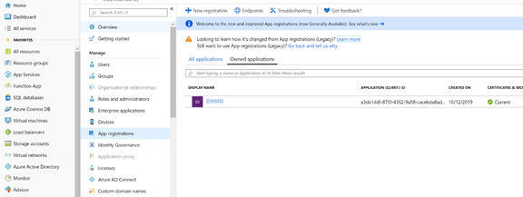
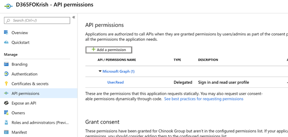
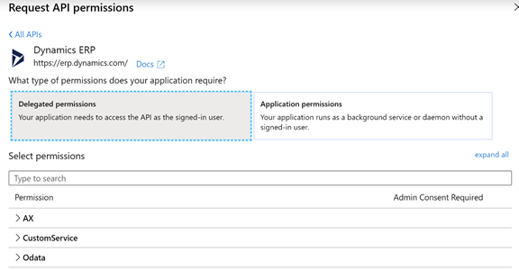
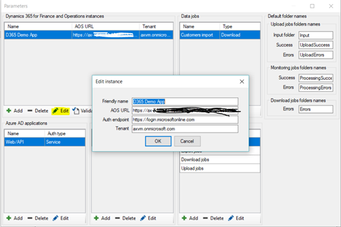
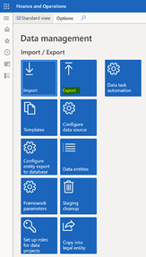
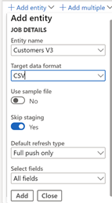

**MB-500: Microsoft Dynamics 365: Finance and Operations Apps Developer**

**Lab 6b - Recurring Data Transfer**

Lab Environment
===============

In order to run this lab, you will need:

-   An all-in-one demo data VM with

    -   Visual Studio installed, and a Visual Studio subscription

    -   A browser to run the user interface

    -   Lab 1 – Development Environment Configuration completed

-   Access to the Azure portal to register your application in Azure Active
    Directory through the link <https://portal.azure.com>

-   Recurring Integration Scheduler, which may be downloaded from
    <https://github.com/Microsoft/Recurring-Integrations-Scheduler/releases> as
    Recurring.Integrations.Scheduler.Setup.exe. This may require .NET 4.7.2.

Lab Overview
============

-   Dependency: Lab 1 – Development Environment Configuration should be
    completed

-   Registering app in Azure Active Directory

-   Install and configure Recurring Integration Scheduler

-   Configure Data Management for recurring integration

**Estimated time to complete this lab: 45+ minutes**

 Scenario
=========

-   Register your Finance and Operations application in Azure AD

-   Install client tool Recurring Integration Scheduler and configure

-   Configure recurring integration in the Data Management workspace

-   Execute the recurring data transfer for the Customers entity

Exercise 1: Register with Azure AD
==================================

Task 1: Register Application and Create Application Key
-------------------------------------------------------

1.  Navigate to <https://portal.azure.com> and continue to the website

2.  Log in, or create a login, if necessary

3.  Select **Azure Active Directory** in the left panel and select **App
    Registrations** in the middle panel. Then select the **New Registration**
    button

    If you cannot locate it, search All services for App registrations

    

4.  Select New registration and input a name for your application such as
    **D365FO\<your name\>**

5.  Select *Accounts in any organizational directory (Any Azure AD directory –
    Multitenant)* as Supported account type

6.  In the Redirect URI select Web and enter *http://localhost* in the following
    field

7.  After verifying your input, please select the **Register** button

    

8.  Wait a moment for the registration

9.  Open your app; click Overview and copy the contents of Application (Client)
    ID. Paste it into a notepad or similar

    

10. Open your app; select **API permissions** under **Manage** Panel

    

11. Select **Add a Permission** button and select **Dynamics ERP.** There will
    be two types of permissions (Delegated and Application). Click each and
    select all the permissions. Click **Add permissions**

  
12.The next step is to add the key, for which you need to go back to the Manage
    panel and select **Certificates & secrets**. Click the button **New client
    secret**. Enter **Description**, where you can input any name of the key or
    leave it blank. You are just naming this key set, select the **Duration**
    and click **Add**

13.Your new Key will be created under Client secrets. Copy the **Key Value**
    and save it; you will need this key in future labs. Should you lose it, you
    can always come back here and create a new one.

Exercise 2: Install and Configure Recurring Data Export/Import Scheduler
========================================================================

In this exercise, you will configure Recurring Integration Scheduler and make it
compatible to work with the Data Management module of Dynamics 365.

Task 1: Install Recurring Integration Scheduler
-----------------------------------------------

1.  Install Recurring.Integrations.Scheduler.Setup.exe from your VM, or go to
    <https://github.com/Microsoft/Recurring-Integrations-Scheduler/releases> and
    download it

2.  You may get security alerts but this scheduler is tested

3.  Install **Recurring Integration Scheduler Setup**

4.  If it needs .NET, your resources include NDP472-KB4054531-Web.exe.

5.  Once the application has been installed you should be able to find the
    following service called Recurring Integrations Scheduler running

6.  Recurring Integrations Scheduler should be installed in Start Menu

Task 2: Configure Recurring Integration Scheduler
-------------------------------------------------

1.  Open **Recurring integration scheduler** and select **Parameters**

 

2.In the Parameters form, add the **Dynamics 365  Finance and Operations
    Apps instance** details

   a.  Friendly name: D365 Demo app

   b.  AOS URL: Enter the URL from your instance through the .com/

   c.  Auth endpoint: <https://login.microsoftonline.com>

   d.  Tenant: This is your tenant. One way to find it is to mouseover your
   avatar in the top right of the Azure portal; it is labeled Domain

 

3.In the Parameters form, add **Azure Active Directory Application** details

   a.  Friendly Name: Web/API

   b.  Client ID: Enter App/client ID saved earlier

   c.  Auth endpoint: <https://login.microsoftonline.com>

   d.  Tenant: Enter your tenant

4.In the Parameters form, add **User Credentials**

5.Select the **Validate** button on the Parameter form under the **Dynamics
    365 for Finance and Operation instances** section. The Validate instance
    setting window will pop up. Select **Service Authentication** and select
    **Validate** button. In the white text box **OK** should appear, or that the
    authentication was successful. Warnings about privileges are not an issue.

Exercise 3: Configure Dynamics 365 Finance and Operations Apps for recurring integrations
=========================================================================================

Task 1: Set up Data Management 
-------------------------------

1.  Go to **All workspaces \> Data management**.

2.  Click **Export**.

Setup the export definition by clicking the **Export** button

3.Enter **Customer Recurring job** as Group name.

4.Click **Add entity** and input as follows:

   a.  Entity name: Customers V3

   b.  Target data format: CSV

   c.  Use sample file: No

   d.  Skip staging: Yes

   e.  Default refresh type: Full push only

   f.  Select fields: All fields

5.Click **Add** button and **Save** the export job.

6.Then click **Create recurring data job**

7.Set up the data job as follows: Choose a name and under Setup authorization
    policy, enter the application ID.

    Note: Make a note of the ID which is on this form. This is the Activity ID
    for this data job.

    The application ID entered on this form is the client ID of the Azure AD
    Application.

a.  Set up the recurrence as follows: Recurrence pattern: Minutes, repeat
    after/count/1

8.Finally press **Ok** to create the recurring job.

 Task 2: Setup Recurring Integration Client
-------------------------------------------

1.  Open **Recurring Integration Client**

2.  Select **Connect to service** and enter the following settings:

    a.  Hostname: localhost

    b.  Port: 555

    c.  Scheduler: RecurringIntegrationsScheduler

3.Once connected, select **Parameters**

4.Add a download job definition as shown:

   a.  Friendly name: Customer import

   b.  Activity ID: enter the Activity ID saved earlier

   c.  Data job type: Download

Note: The activity ID is the activity ID of the recurring integration data job
that we created in D365fO.

5.Now in the main form, Select **Add Job** and create a download job

    Note: The folder is where you want the downloaded files to be placed. It
    should be a new folder, as files will accumulate.

   

Task 3: Set up AAD Parameter in Dynamics 365 Finance and Operations Apps
------------------------------------------------------------------------

1.  Go to **System Administration \> Setup \> Azure Active Directory
    Application**

2.  In the Client Id, put the Application ID of the registered app in Azure AD

3.  Specify Name – **Recurring Data Integration**

4.  Specify User id – your user credentials

Now you would be able to validate that the files that are generated are
downloaded into the local folder.

Check Output
============

In the folder, specified in the Recurring Integration Scheduler tool, you will
find the customer’s data is getting exported based on the defined interval.
