---
lab:
    title: 'Lab 1: Work with trace and import it into the Trace Parser tool'
    module: 'Learning Path 01: Introduction to developing with finance and operations apps'
---

**MB-500: Microsoft Dynamics 365: Finance and Operations Apps Developer**

# Lab 1: Work with trace and import it into the Trace Parser tool

# Change Record

<html>
<table><tr><th>Version</th><th>Date</th><th>Change</th></tr>
<tr><td>1.0</td><td>23 Aug 2024</td><td>Initial release</td></tr>
</table>
</html>

# Objective

This lab consists of three exercises. Requirements include a working development
virtual machine (VM) with access to finance and operations apps, the Trace
Parser tool, and SQL Server Management Studio (SSMS). For the lab:

1.  In the first exercise, you’ll record a performance issue scenario with the
    Task recorder tool.

2.  In the second exercise, you’ll import the downloaded file from Task recorder
    into Trace Parser.

3.  In the last exercise, you’ll analyze records in Trace Parser.

# Prerequisites

To prepare for the exercises:

1.  Select **Windows** and search for and open **Trace Parser**.

2.  Enter a dot (.) in **Server name**, and then enter **TraceDB** in **Select
    or enter a database name**.

3.  Select **Register** and **Yes** to create the database, and then select
    **Capture Events**.

4.  Verify **Microsoft-Dynamics-AX-XppExecutionTraces** and
    **Microsoft-Dynamics-AX-ExecutionTraces** events exist in the top three
    rows. If they *do not* exist, you must activate them. If they do, close
    Trace Parser and proceed to Exercise 1.

5.  Open **File Explorer** and navigate to
    **C:\\AOSService\\webroot\\Monitoring**.

6.  Right-click **DynamicsAXExecutionTraces.man** to open the context menu, and
    then select **Open with**.

7.  Select **Try an app on this PC**, and then select **Notepad** and select
    **OK**.

8.  Select **Edit** and **Replace**, and then enter **%APPROOT%** in **Find
    what**.

9.  Enter **C:\\AOSService\\webroot** in **Replace with**:

    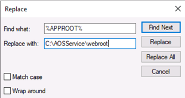

10. Select **Replace All**, select **Cancel**, close **Notepad**, and then
    select **Save**.

11. Right-click **DynamicsAXXppExecutionTraces.man** to open the context menu,
    and then select **Open with**.

12. Select **Notepad**, clear **Always use
    this app to open .man files**, and then select **OK**.

13. Select **Edit** and **Replace**, and then enter **%APPROOT%** in **Find
    what**.

14. Enter **C:\\AOSService\\webroot** in **Replace with**.

15. Select **Replace All**, select **Cancel**, close **Notepad**, and then
    select **Save**.

16. Open Windows PowerShell as Admin, and then enter each of the following,
    selecting **Enter** after each entry:

	<ul><li> <b>wevtutil um
	    "C:\\AOSService\\webroot\\Monitoring\\DynamicsAXExecutionTraces.man"</b>
	
	</li><li> <b>wevtutil um
	    "C:\\AOSService\\webroot\\Monitoring\\DynamicsAXXppExecutionTraces.man"</b>
	
	</li><li> <b>wevtutil im
	    "C:\\AOSService\\webroot\\Monitoring\\DynamicsAXExecutionTraces.man"</b>
	
	</li><li> <b>wevtutil im
	    "C:\\AOSService\\webroot\\Monitoring\\DynamicsAXXppExecutionTraces.man"</b>
	</li></ul>
17. Close **Trace Parser**.

18. Select **Windows**, and search for and open **Trace Parser**.

19. Select **Capture Events**, and then verify
    **Microsoft-Dynamics-AX-XppExecutionTraces** and
    **Microsoft-Dynamics-AX-ExecutionTraces** events exist in the top three
    rows
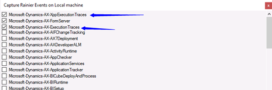

   
>   If the events exist, the Trace is working. Close Trace Parser.

# Exercise 1: Create a trace using Task recorder 

To create a trace using the Task recorder tool:

1.  Open Microsoft Edge in your VM.

2.  Go to [Dashboard -- Finance and Operations
    (dynamics.com)](https://usnconeboxax1aos.cloud.onebox.dynamics.com/?cmp=USMF&mi=DefaultDashboard)
    and sign in to the finance and operations apps with your account.

3.  Select the question mark on the upper-right of the Edge window, and then select **Trace**
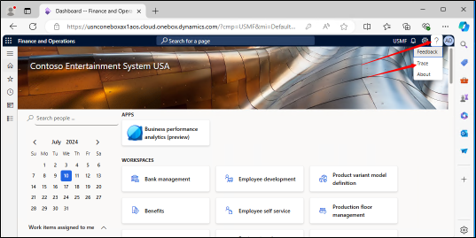

1.  Enter the following when the **Tracing** dialog opens, and then select
    **Start trace**:

    -   Trace name: **MB500Trace**

    -   Include SQL parameter values: **Yes**
        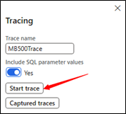

2.  Notice that the trace is running, and leave the window open
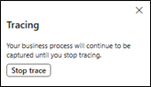
Users have reported that sales orders are working slowly, so you’ll need to review the sales order lines and check reservations against on-hand supply.

6.  In the **Navigation** pane, select **Modules**, and then select **Accounts
    receivable**.

7.  In the menu for **Accounts receivable**, select the **Orders** menu, and
    then select **All sales orders**
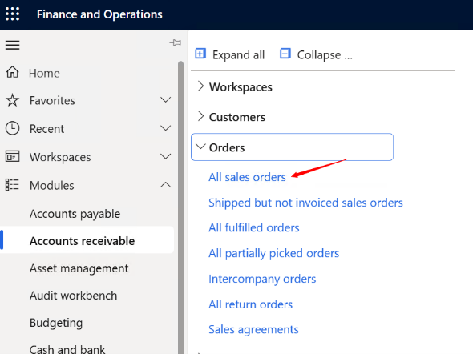

1.  Select the last sales order in the list and the lines will open
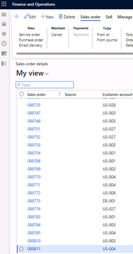

1.  In **Sales order details**, select **Inventory** in the (lower) **Action**
    pane for sales order lines.

    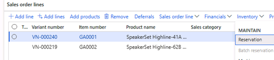

2.  Select **Reservation** to check the reservation against on-hand supply.

3.  Stop the trace by selecting **Stop trace**.
    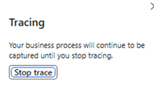

4.  Download or upload the trace after it stops. Uploading a trace saves it in
    finance and operations apps, from which you then can download it repeatedly.  
    **Important:** If you download a trace without uploading it first, the trace
    is deleted.
    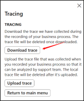

5.  Select **Download trace**, and the trace is stored in the **Downloads**
    folder on the VM.

# Exercise 2: Import the downloaded trace into Trace Parser

To import a trace you’ve downloaded into the Trace Parser tool:

1.  Select Start in your VM and then enter **Trace** in the search field
    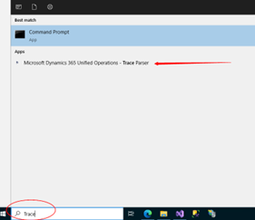

2.  Select the **Microsoft Dynamics 365 Unified Operations – Trace Parser**.

	>   If this is your first time using the Trace Parser tool, no database is
	>   registered, so you’ll receive a prompt to create one:
	
	1.  Enter the following to create a database on the local VM:
	
	    -   Server name: **. (type in a dot for local server)**
	
	    -   Select or enter a database name: **D365Trace**
	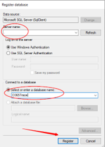
	
	
	
	1.  Select **Register** to create the database for the trace file.
	
	2.  If the database name doesn’t exist in SQL Server, a prompt will appear with
	    the message “*The specific database does not exist. Would you like to create
	    it?”*
	
	3.  Select **Yes** to create the database.

1.  Select **Import Trace** and navigate to the trace file (Downloads
    folder), and then select it.

2.  Select **Open** to import the file:

    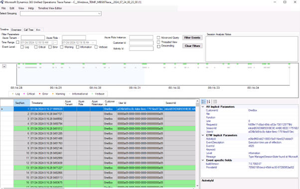

>   The import process will take a few minutes.

# Exercise 3: Analyze in Trace Parser

To analyze X++ and SQL for users in the Trace Parser tool:

1.  Select the **Select Grouping** option, and then select your applicable user
    account. The trace parser will filter for your specific user.

2.  Select **Call Tree** to see the call stack, and then move down to find the
    reddest color.

3.  Expand the tree node for the reddest color (the largest number of ms) and
    continue until all nodes are expanded, and make sure you’re watching the
    **Context field** to see the X++ code
    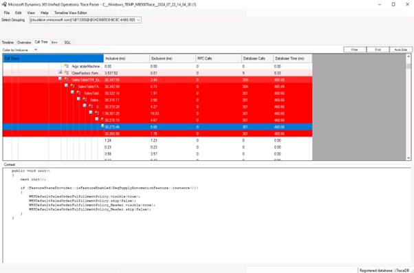

4.  Select **X++** next to **Call tree**, and then select the **Total Inclusive
    (ms)** column to sort the most expensive in descending order.

5.  Find the first row with **Code** to see the most expensive code, and then
    select **SQL** next to X++.

6.  Select **Show Tables**, and then enter **SalesTable** in **Name Filter**.
    Only SQL statements visible on **SalesTable** should be listed.

7.  Enter **InventTrans** in **Name Filter** and **Show Tables**. Only SQL
    statement in **InventTrans** should now be listed in the view

    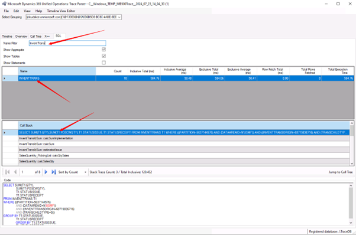

8.  Select **Jump to Call Tree** (lower right between the Call Stack and Code)
    and wait. **Trace Parser** goes to **Call Tree**, and you can see the call
    stack.
