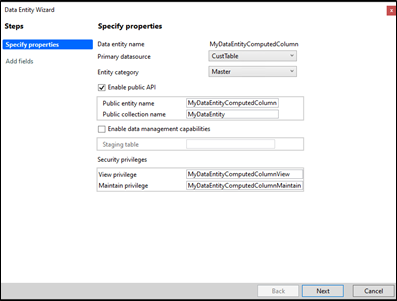
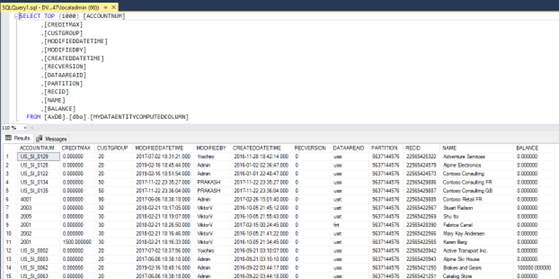
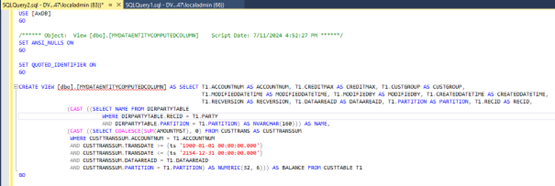
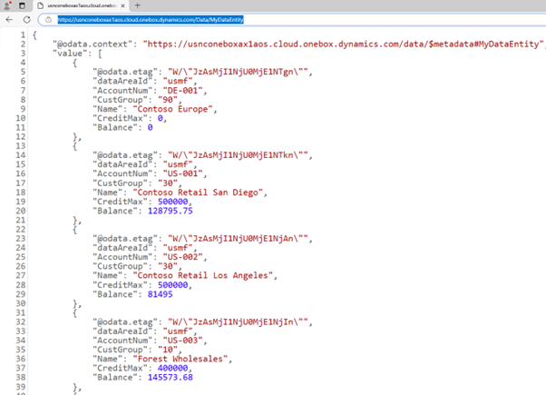

---
lab:
    title: 'Lab 2: Create a data entity with a computed column'
    module: 'Learning Path 02: Build finance and operations apps'
---

**MB-500: Microsoft Dynamics 365: Finance and Operations Apps Developer**

# Lab 2: Create a data entity with a computed column

# Change Record

<html>
<table><tr><th>Version</th><th>Date</th><th>Change</th></tr>
<tr><td>1.0</td><td>23 Aug 2024</td><td>Initial release</td></tr>
</table>
</html>

# Objective

This lab consists of several exercises.

Requirements include:

-   A working development virtual machine (VM) with access to the finance and
    operations apps and Microsoft Visual Studio.

-   A module and an existing solution for development.

In the first exercise, you’ll create a data entity for a customer with the
following fields:

-   Customer account

-   Customer group

-   Name

-   Credit limit

-   Balance (calculated field)

In the second exercise, you’ll test the data entity in SQL Server Management
Studio and as OData in an internet browser.

# Exercise 1: Create a data entity 

To create a data entity:

1.  Open **Visual Studio** on your VM, and then create the solution you want to
    work with:

    -   On Visual Studio 2019, select **Continue without code**

    -   Select **Extensions \> Dynamics 365 \> Model Management \> Create
        Model**
    >   If 'Feedback on Finance and Operations(Dynamics 365)' screen pops up, click on 'Not Now'.
    -   On Create model:

        1.  For Add parameters, enter these values and then select **Next**:

            1.  Model name: **MB-500Lab2**

            2.  Model publisher: **Microsoft**

        2.  For Select package, **Create new package**

        3.  For Select referenced packages, ensure the following are selected:

            1.  **ApplicationFoundation**

            2.  **ApplicationPlatform**

            3.  **ApplicationSuite**

            4.  **ContactPerson**

            5.  **Directory**

        4.  Select **Next** until **Configure your new project**

    -   On **Configure your new project**, enter these values, then select Create:

        1.  Project name: **DataEntityComputedColumn**

        2.  Solution name: **MB500Lab2Sln**

2.  Right-click the **DataEntityComputedColumn** project to open the context
    menu and select **Add** \> **New Item**.

3.  Navigate to **FinanceOperations** \> **Dynamics 365 Items** \> **Data
    Model**.

4.  Select **Data Entity**, and then enter **MyDataEntityComputedColumn** in **Name** and select **Add**.    
The Data Entity Wizard opens.

5.  Select **CustTable** in **Primary datasource**, and then select **Master**
    in **Entity category**.

2.  Select the checkbox next to **Enable public API**, and then enter
    **MyDataEntityComputedColumn** in **Public entity name**.

3.  Enter **MyDataEntity** in **Public collection name**, and then clear the
    **Enable data management capabilities** checkbox, as you don’t want to
    create a staging table.

4.  Keep **Security privileges** as defaulted, and then select **Next**.

5.  The **Add fields** page appears in the **Data Entity Wizard**, and you
    should clear the **Select all** checkbox

6.  Find and select the **AccountNum** field, the **CreditMax** field, the
    **CustGroup** field, and select **Add virtual field**.

7.  Find the empty virtual field at the bottom of the **field list** node, and
    then enter **Name** in **Data entity field name**.

8.  Keep **String** in **Data type**, and then enter:

	-   **CustName** in **EDT type name**.
	
	-   **Name** in **Label Id**.
	
	-   **Customer name** in **Help Text Id**.

1.  Select **Add virtual field**, and then find the empty virtual field at
    the bottom of the field list.

2.  Enter **Balance** in **Data entity field name**, and then **Real** in
    **Data type** and leave the **EDT type name** blank.

3.  Enter **Balance** in **Label Id**, and then enter **Customer balance**
    in **Help Text Id**.

4.  Select **Next**, and the data entity **MyDataEntityComputedColumn** is
    added to the **DataEntityComputedColumn** project.

5.  In Solution Explorer, select the **MyDataEntityComputedColumn** data entity in your project,
    right-click the **Methods** node to open the context menu, select **New
    Method**, and then add this code under existing methods in public class, which retrieves a customer’s
    name, in the public class:

<pre>
private static server str custName() 
    {
        SysDictTable dictTableDirPartyTable = new SysDictTable(tableNum(DirPartyTable));

        return strFmt(@'SELECT %2 FROM %1 
                          WHERE %1.%3 = %5 
                          AND %1.%4 = %6',
            dictTableDirPartyTable.name(DbBackend::Sql),
            dictTableDirPartyTable.fieldName(fieldNum(DirPartyTable, Name), DbBackend::Sql),
            dictTableDirPartyTable.fieldName(fieldNum(DirPartyTable, RecId), DbBackend::Sql),
            dictTableDirPartyTable.fieldName(fieldNum(DirPartyTable, Partition), DbBackend::Sql),
            SysComputedColumn::returnField(tablestr(MyDataEntityComputedColumn), 
                                           dataEntityDataSourceStr(MyDataEntityComputedColumn, CustTable), 
                                           fieldstr(CustTable, Party)),
            SysComputedColumn::returnField(tablestr(MyDataEntityComputedColumn), 
                                           dataEntityDataSourceStr(MyDataEntityComputedColumn, CustTable), 
                                           fieldstr(CustTable, Partition)));
    }

</pre>
18.Now paste in this code, which calculates a customer’s balance, after that
    method and still within the public class:

<pre>
private static server str balanceMST()
    {
        SysDictTable dictTableCustTrans = new SysDictTable(tableNum(CustTrans));

        return strFmt(
            @'SELECT COALESCE(SUM(%11), 0) FROM %1 AS CUSTTRANSSUM
                WHERE CUSTTRANSSUM.%2 = %6
                AND CUSTTRANSSUM.%3 >= %7
                AND CUSTTRANSSUM.%3 <= %8
                AND CUSTTRANSSUM.%4 = %9
                AND CUSTTRANSSUM.%5 = %10',
             dictTableCustTrans.name(DbBackend::Sql),
             dictTableCustTrans.fieldName(fieldNum(CustTrans, AccountNum), DbBackend::Sql),
             dictTableCustTrans.fieldName(fieldNum(CustTrans, TransDate), DbBackend::Sql),
             dictTableCustTrans.fieldName(fieldNum(CustTrans, DataAreaId), DbBackend::Sql),
             dictTableCustTrans.fieldName(fieldNum(CustTrans, Partition), DbBackend::Sql),
             SysComputedColumn::returnField(tablestr(MyDataEntityComputedColumn), 
                                            dataEntityDataSourceStr(MyDataEntityComputedColumn, CustTable), 
                                            fieldstr(CustTable, AccountNum)),
             SysComputedColumn::returnLiteral(dateNull()),
             SysComputedColumn::returnLiteral(dateMax()),
             SysComputedColumn::returnField(tablestr(MyDataEntityComputedColumn), 
                                            dataEntityDataSourceStr(MyDataEntityComputedColumn, CustTable), 
                                            fieldstr(CustTable, DataAreaId)),
             SysComputedColumn::returnField(tablestr(MyDataEntityComputedColumn), 
                                            dataEntityDataSourceStr(MyDataEntityComputedColumn, CustTable), 
                                            fieldstr(CustTable, Partition)),
             dictTableCustTrans.fieldName(fieldNum(CustTrans, AmountMST), DbBackend::Sql));
    }

</pre>

19.Select **Save All**, and then close the code editor.

20.Navigate to, and expand, the **Fields** node at the data entity, and then
    select the **Name** virtual field, and then configure the following
    properties:

-   Is Computed Field: **Yes**

-   DataEntityView Method: **custName**

-   Extended Data Type: **CustName**

21.Select the **Balance** virtual field, and then configure the following
    properties:

-   Is Computed Field: **Yes**

-   DataEntityView Method: **balanceMST**

-   Extended Data Type: **AmountMST**

22.Select **Save All**, and then go to the **DataEntityComputedColumn** project
    in **Solution Explorer**.

23.Right-click the project to open the context menu, and then select
    **Properties**.

24.Configure the following field:

-   Synchronize Database: **True**

25.Select **OK**, and then right-click the project to open the context menu and
    select **Build**.

# Exercise 2: Test a data entity in SQL Server Management Studio and as OData

To test your new data entity in SQL Server Management Studio and as OData:

1.  Open Microsoft SQL Server Management Studio in your VM and connect to the
    Database Engine with Windows Authentication.

2.  In **Object Explorer,** navigate to **Databases** and **AxDB**, and then
    expand the **AxDB** and **Views** nodes.

3.  Navigate to view **dbo.MYDATAENTITYCOMPUTEDCOLUMN**, and then right-click it
    to open the context menu, and select the **Select Top 1000 Rows** item:

    

4.  Right-click the **dbo.MYDATAENTITYCOMPUTEDCOLUMN** view to open the context
    menu, and then select **Script View as** \> **CREATE To** \> **New Query
    Editor Window**

    

5.  Review the code for creating a data entity view.

6.  Note the computed columns.

7.  Open Microsoft Edge in your VM and set your default legal entity: navigate
    to your Dynamics 365 home page, select the gear and **User Options**,
    navigate to the **Preferences** tab, and set the **Startup Company** to
    **USMF**.

8.  Enter the following URL in the browser address field:
    <https://usnconeboxax1aos.cloud.onebox.dynamics.com/Data/MyDataEntity> in
    the browser address field. The **MyDataEntity** data entity will display in
    OData format in the browser

    
