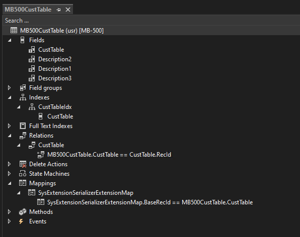
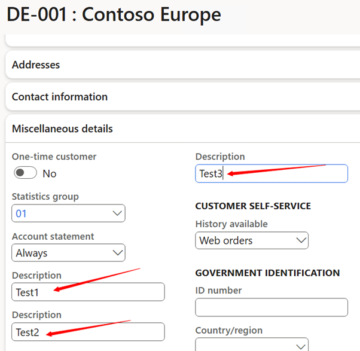
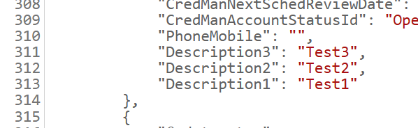

---
lab:
    title: 'Lab 3: Implement the SysExtensionSerializer framework'
    module: 'Learning Path 03: Extend finance and operations apps'
---

**MB-500: Microsoft Dynamics 365: Finance and Operations Apps Developer**

# Lab 3: Implement the SysExtensionSerializer framework

# Change Record

<html>
<table><tr><th>Version</th><th>Date</th><th>Change</th></tr>
<tr><td>1.0</td><td>23 Aug 2024</td><td>Initial release</td></tr>
</table>
</html>

# Objective

This lab consists of several exercises.

Requirements include:

-   A working development virtual machine (VM) with access to the finance and
    operations apps and Microsoft Visual Studio.

-   A module and existing solution for development. 

In the first exercise, you’ll use the **SysExtensionSerializer** framework to
create three new text fields on the **CustTable** table, which supports the
framework. The fields you’ll create on the linked table include:

-   **Description1**

-   **Description2**

-   **Description3**

In the second exercise, you’ll create the **SysExtensionSerializer** framework
modifications for the **CustTable** form, and then in the third exercise, you’ll
include the linked table into the **CustCustomerV3Entity** entity.

In the fourth and final exercise, you’ll test the modifications you’ve made for
both the customer form and the **CustomersV3 data** entity.

# Exercise 1: Implement the **SysExtensionSerializer** framework for a table 

To implement the **SysExtensionSerializer** framework and create three new text
fields for the **CustTable** table:

1.  Open **Visual Studio** on your VM.

2.  Create the solution you want to work with:

    -   On Visual Studio 2019, select **Continue without code**

    -   Select **Extensions \> Dynamics 365 \> Model Management \> Create
        Model**
    >   If 'Feedback on Finance and Operations(Dynamics 365)' screen pops up, select 'Not Now'.
    -   On Create model:

        1.  For Add parameters, enter these values and then select **Next**:

            1.  Model name: **MB-500Lab3**

            2.  Model publisher: **Microsoft**

        2.  For Select package, **Create new package**

        3.  For Select referenced packages, ensure the following are selected:

            1.  **ApplicationFoundation**

            2.  **ApplicationPlatform**

            3.  **ApplicationSuite**

            4.  **Dimensions**

            5.  **Directory**

            6.  **PersonnelCore**

        4.  Select **Next** until **Configure your new project**

    -   On **Configure your new project**, enter these values, then select
        **Create**:

        1.  Project name: **SysExtensionSerializerFramework**

        2.  Solution name: **MB500Lab3Sln**

3.  Right-click your project to open the context menu and select **Properties**.

4.  Make sure the **Synchronize Database** property is set to **True**, and then
    select **OK**.

5.  Right-click your project to open the context menu, and then select **Add**,
    and select **Table**.

6.  Enter **MB500CustTable** as the name, and then select **Add**.

7.  In **View** \> **Application Explorer**, go to the search field, and then
    enter **RefRecId** in the **Search** field, and select **Enter**.

8.  Navigate to the **RefRecId** Extended Data Type, and then drag it into the
    **Fields** node for the **MB500CustTable** table.

9.  Select the **RefRecId** field, and then in **Properties**, select
    **CustTable** for the **Name**.

10. In **Application Explorer**, navigate to the **Search** field, enter
    **Description**, and then select **Enter**.

11. Navigate to the Extended Data Type **Description**, and then drag it into
    the **Fields** node for the **MB500CustTable** table.

12. Select the **Description** field, and in **Properties** enter the name
    **Description1**.

13. Drag the Extended Data Type **Description** into the **Fields** node for the
    **MB500CustTable** table, and then select the **Description** field.

14. In **Properties**, enter **Description2** in the **Name** field.

15. Drag the Extended Data Type **Description** into the **Fields** node for the
    **MB500CustTable** table, and then select the **Description** field.

16. In Properties, enter **Description3** in the **Name** field.

17. Navigate to the **Indexes** node at **MB500CustTable** in the **Designer**.

18. Right-click **Indexes** to open the context menu, and then select **New Index**.

19. In **Properties**, enter the following:

    -   Name: **CustTableIdx**

    -   Allow Duplicates: **No**

    -   Alternate Key: **Yes**

20. Drag the **CustTable** field from the **Fields** node to the
    **CustTableIdx** node.

21. Navigate to the **Mappings** node for the **MB500CustTable**, right-click it
    to open the context menu, and select **New Mapping**.

22. In **Properties**, navigate to the **Map** property, and then select the
    **drop-down** arrow.

23. In the **Search** field, enter **SysExt**, and then select
    **SysExtensionSerializerExtensionMap**.

24. Navigate to **SysExtensionSerializerExtensionMap** in the **Mappings** node,
    and then expand **SysExtensionSerializerExtensionMap**.

25. Navigate to **BaseRecId**, and then in Properties, select the **drop-down**
    arrow by **Map Field To**.

26. Select the **CustTable** field, and then navigate to the **Relations** node
    for the **MB500CustTable**.

27. Right-click **Relations** to open the context menu, and then select **New**,
    and select **Relation**.

28. Set the following properties for **Relation1**:

    -   Cardinality: **ZeroOne**

    -   Name: **CustTable**

    -   On Delete: **Cascade**

    -   Related Table: **CustTable**

    -   Related Table Cardinality: **ExactlyOne**

    -   Relationship type: **Composition**

29. Right-click **CustTable** Relation to open the context menu, and then select
    **New**, and select **Normal**.

30. Set the following properties for the **RelationConstraintField1** :

    -   Field: **CustTable**

    -   Related Field: **RecId**

31. Navigate to **Properties** for the **MB500CustTable** table, and then enter
    **CustTableIdx** for **Replacement Key**.

32. Navigate to the **Methods** node for **MB500CustTable**.

33. Right-click **Methods** to open the context menu, and then select
    **Override**, and select **insert**.

34. Change the logic in the **insert** method to the following:<pre>public void insert()
    {
        if (this.CustTable)
        {
            super();
        }
    }
</pre>

35. Navigate to the **Methods** node on **MB500CustTable**, and then right-click **Methods** to open the context menu and select **Override** and **update**.

2.  Change the logic in the **update** method to the following:<pre>public void update()
    {
        if (this.CustTable)
        {
            super();
        }
    }
</pre>

1.  Select **Save All**, and then right-click the
    **SysExtensionSerializerFramework** project to open the context menu and
    select **Build.** 

  

# Exercise 2: Implement the **SysExtensionSerializer** framework for a form 

To implement the **SysExtensionSerializer** framework for a form:

1.  In **Solution Explorer**, select the **SysExtensionSerializerFramework**
    project.

2.  In **Application Explorer**, navigate to the **Search** field, enter
    **CustTable**, and then select **Enter**.

3.  Navigate to the **User Interface** node, and then select **Forms**.

4.  Right-click the **CustTable** form to open the context menu, and then select
    **Create Extension**. The extension for the **CustTable** form is created.

5.  In **SolutionExplorer**, Right-click the form extension for the **CustTable** form to open the
    context menu, and then select **Open**.

6.  In **Designer**, navigate to **Data Sources**, and then right-click **Data
    Sources** to open the context menu, and then select **New Data Source**.

7.  Enter the following properties for the **DataSource1** data source:

    -   Table: **MB500CustTable**

    -   Join Source: **CustTable**

    -   Link type: **OuterJoin**

    -   Insert At End: **No**

    -   Insert If Empty: **No**

8.  In **Design**, navigate to **Tab** \> **TabPageDetails** \> **TabHeader \>
    TabDetails \> Administration**, and then navigate to the **Fields** node for
    the **MB500CustTable** data source.

9.  Drag the following fields into the **Administration** group in the form
    design:

    -   **Description1**

    -   **Description2**

    -   **Description3**

10. Select **Save All**, and then in the **Application Explorer**, navigate to
    the **Search** field.

11. Clear the **Search** field, and then select **Enter**.

12. Enter **CustTable** in the **Search** field, and then select **Enter**.

13. Navigate to **User Interface** \> **Form Extensions**, find your form
    extension CustTable.MB500Lab3, and then navigate to the **DataSources**
    node.

14. Find the **MB500CustTable** data source, and then right-click it to open the
    context menu and select **Create Code Extension**.

15. Right-click the code extension class, such as
    **CustTable_MB500CustTable_MB500Lab3_Extension**, in the
    **SysExtensionSerializerFramework** project in **Solution Explorer** to open
    the context menu, and then select **Open**.

16. Create a chain of command for the **init** method:<pre>[ExtensionOf(formDataSourceStr(CustTable, MB500CustTable))]
final class CustTable_MB500CustTable_MB500Lab3_Extension
{
    /// 

    /// Chain of command method which making extensionTablePair in standard CustTable form
    /// 

    public void init()
    {
        next init();

        FormDataSource  MB500CustTable_DS   = this;
        FormRun         formRun             = MB500CustTable_DS.formRun();
        FormDataSource  custTable_DS        = formRun.dataSource(formDataSourceStr(CustTable, CustTable));

           SysExtensionSerializerFormRunHelper::construct().addExtensionTablePair(CustTable_DS.cursor(), MB500CustTable_DS.cursor());
    }
}
</pre>

1.  Navigate to **User Interface** \> **Forms** in **Application Explorer**, and
    then find the **CustTable** form.

2.  Navigate to the **DataSources** node, and then find the **CustTable** data
    source.

3.  Right-click **CustTable** to open the context menu, and then select **Create
    Code Extension**.

4.  Right-click the code extension class, such as
    **CustTable_CustTable_MB500Lab3_Extension**, in the
    **SysExtensionSerializerFramework** in **Solution Explorer** to open the
    context menu, and then select **Open**.

5.  Create a chain of command for the **write** method:<pre>[ExtensionOf(formDataSourceStr(CustTable, CustTable))]
final class CustTable_CustTable_MB500Lab3_Extension
{
    /// 

    /// CoC of CustTable_DS write method
    /// 

    void write()
    {
        next write();

        FormDataSource MB500CustTable_DS = this.formRun().dataSource(formDataSourceStr(CustTable, MB500CustTable));

        if (MB500CustTable_DS)
        {
            CustTable       custTable      = this.cursor();
            MB500CustTable  MB500CustTable = MB500CustTable_DS.cursor();

            if (SysExtensionSerializerExtensionMap::isExtensionEnabled(tableNum(MB500CustTable)))
            {
                MB500CustTable.SysExtensionSerializerExtensionMap::insertAfterBaseTable(CustTable);
            }
        }
    }

}</pre>

22.Select **Save All**, and then find the **SysExtensionSerializerFramework**
    project in **Solution Explorer**, right-click it to open the context menu,
    and then select **Build**.

# Exercise 3: Update data entities when using the **SysExtensionSerializer** framework

To update data entities when you’re using the **SysExtensionSerializer**
framework:

1.  In **Solution Explorer**, select the **SysExtensionSerializerFramework**
    project, and then in **Application Explorer**, navigate to the **Search**
    field.

2.  Enter **CustCustomer** in the **Search** field, and then select **Enter**.

3.  Navigate to the **Data Model** \> **Date Entities** node, and then find the
    **CustCustomerV3Entity** data entity.

4.  Right-click the **CustCustomerV3Entity** data entity to open the context
    menu, and then select **Create Extension**.

5.  Right-click the **Extension** data entity, such as
    **CustCustomerV3Entity.MB500Lab3**, in the
    **SysExtensionSerializerFramework** project in **Solution Explorer** to open
    the context menu, and then select **Open**.

6.  In **Designer**, navigate to the **Data Sources** node, and then expand the
    **CustTable** data source.

7.  Select **Data Sources** for the child data sources, and then right-click
    **Data Sources** to open the context menu and select **New Data Source**.

8.  Enter the following on the new **QueryEmbeddedDataSource1** data source
    properties:

    -   Table: **MB500CustTable**

    -   Join Mode: **OuterJoin**

    -   Use Relations: **Yes**

9.  Navigate to the **Fields** node on the **MB500CustTable** data source, and
    then expand the **Fields** node.

10. Right-click the **Description1** field to open the context menu, and then
    select **Copy**.

11. Navigate down to the **Fields** node for the **Data Entity** extension, and
    then right-click it to open the context menu and select **Paste**.

12. Navigate to the **Fields** node for the **MB500CustTable** data source, and
    then expand the **Fields** node.

13. Right-click the **Description2** field to open the context menu, and then
    select **Copy**.

14. Navigate to the **Fields** node at the **Data Entity** extension, and then
    right-click it to open the context menu and select **Paste**.

15. Navigate to the **Fields** node on the **MB500CustTable** data source, and
    then expand the **Fields** node.

16. Right-click the **Description3** field to open the context menu, and then
    select **Copy**.

17. Navigate to the **Fields** node for the **Data Entity** extension, and then
    right-click it to open the context menu, and then select **Paste**.

18. Select **Save All**, and then in **Application Explorer**, navigate to
    **Data Model** and **Tables**.

19. Find the **CustCustomerV3Staging** table, and then right-click it to open
    the context menu and select **Create Extension**.

20. Right-click the table extension, such as
    **CustCustomerV3Staging.MB500Lab3**, in the
    **SysExtensionSerializerFramework** project in **Solution Explorer** to open
    the context menu, and then select **Open**.

21. Expand the **Fields** node in **Designer**, and then in **Application
    Explorer**, navigate to the **Search** field.

22. Enter **Description**, and then select **Enter**.

23. Navigate to the Extended Data Type **Description**.

24. Drag the Extended Data Type **Description** into the **Fields** node for the
    **CustCustomerV3Staging.MB500Lab3** table extension.

25. Select the field **Description**, and then in **Properties**, enter
    **Description1** in the **Name** field.

26. Drag the Extended Data Type **Description** into the **Fields** node for the
    **CustCustomerV3Staging.MB500Lab3** table extension.

27. Select the **Description** field, and then in **Properties**, enter
    **Description2** in the **Name** field.

28. Drag the Extended Data Type **Description** into the **Fields** node for the
    **CustCustomerV3Staging.MB500Lab3** table extension, and then select the
    **Description** field.

29. In **Properties**, enter **Description3** in the **Name** field, and then
    select **Save All**.

30. Find the **SysExtensionSerializerFramework** project in **Solution
    Explorer**, and then right-click it to open the context menu and select
    **Build**.

31. Right-click the project again to open the context menu, and then select
    **Synchronize SysExtensionSerializerFrameform (USR) with Database**.

# Exercise 4: Test modifications from the **SysExtensionSerializer** framework 

To test modifications:

1.  Open Microsoft Edge on your VM, and then go to the [Dashboard -- Finance and
    Operations
    (dynamics.com)](https://usnconeboxax1aos.cloud.onebox.dynamics.com/?cmp=USMF&mi=DefaultDashboard)
    URL, and sign in to finance and operations apps.

2.  In the Navigation Pane, expand **Workspaces**, and then select **Data
    Management** and select **Framework Parameters**.

3.  Navigate to **Entity Settings**, and then select **Refresh entity list**.
    The entity list should now be updated with your modifications.

4.  In Navigation Pane, expand **Modules**, and then select **Accounts
    receivable**.

5.  Expand **Customers**, select **All customers**, and then select the first
    customer.

6.  Select **Edit** for editing, and then in the **Miscellaneous details**
    FastTab, enter the following in the **Description** fields:

    -   Description: **Test1**

    -   Description: **Test2**

    -   Description: **Test3**

1.  Select **Save** and navigate to the **Accounts receivable** module, expand
    **Customers**, and then select **All customers**.

2.  Select the first customer, and then verify the values in the three
    description fields.

3.  Navigate to **Settings** (the gear on the top right), select **User
    options**, go to the **Preferences** tab, and change the **Startup Company**
    to **USMF**.

4.  Open a new tab in Microsoft Edge on your VM, and enter the following URL:
    [usnconeboxax1aos.cloud.onebox.dynamics.com/data/CustomersV3?cmp=USMF](https://usnconeboxax1aos.cloud.onebox.dynamics.com/data/CustomersV3?cmp=USMF).

5.  Select **Enter**, and then find rows **311** through **313** (this may vary
    slightly), and verify the values in the new fields for the data entity:

