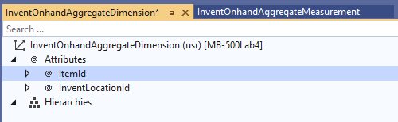
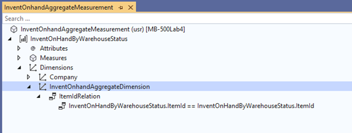
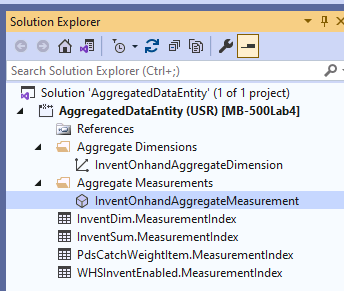
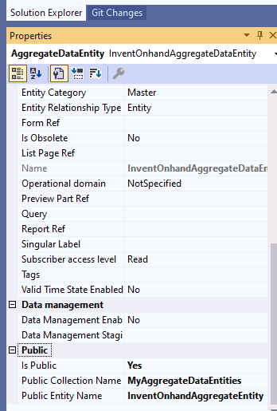
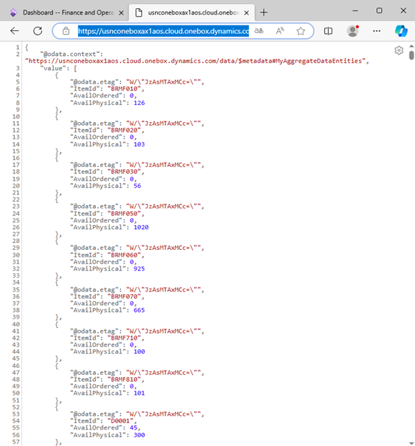

---
lab:
    title: 'Lab 4: Create an aggregated data entity'
    module: 'Learning Path 04: Connect to finance and operations'
---

**MB-500: Microsoft Dynamics 365: Finance and Operations Apps Developer**

# Lab 4: Create an aggregated data entity

# Change Record

<html>
<table><tr><th>Version</th><th>Date</th><th>Change</th></tr>
<tr><td>1.0</td><td>23 Aug 2024</td><td>Initial release</td></tr>
</table>
</html>

# Objective

This lab consists of several exercises. Requirements include a working
development virtual machine (VM) with access to the finance and operations apps
and Microsoft Visual Studio. In the:

-   First exercise, you’ll create an aggregated data entity for inventory
    onhand.

-   Second exercise, you’ll test the outcome of the aggregated data entity.

# Exercise 1: Create an aggregated data entity

To create an aggregated data entity:

1.  Open **Visual Studio** 2019 on your VM and select **Continue without code**.

2.  Create the solution you want to work with:

    -   Select **Extensions \> Dynamics 365 \> Model Management \> Create
        Model**.
    >   If 'Feedback on Finance and Operations(Dynamics 365)' screen pops up, select 'Not Now'.
    -   In **Create model**:

        1.  For **Add parameters**, enter the following values, and then select
            **Next**:

            -   Model name: **MB-500Lab4**

            -   Model publisher: **Microsoft**

        2.  For **Select package**, select Create **new package**.

        3.  For **Select referenced packages**, ensure the following are
            selected:

            -   **ApplicationFoundation**

            -   **ApplicationPlatform**

            -   **ApplicationSuite**

        4.  Select **Next** and **Next**

    -   On **Configure your new project**, enter these values, and then select
        **Create**:

        1.  Project name: **AggregatedDataEntity**

        2.  SolutionName: **AggregatedDataEntity**

3.  In Solution Explorer, right-click your project to open the context menu, and
    then select **Properties**.

4.  Verify the **Synchronize Database** property is set to **True**, and then
    select **OK**.

5.  Right-click your project to open the context menu, and then select **Add**
    \> **New Item**.

6.  Navigate to **FinanceOperations** \> **Dynamics 365 Items** \> **Analytics**
    \> **Aggregate Measurement**.

7.  Enter **InventOnhandAggregateMeasurement** as the name, and then select
    **Add**.

8.  Select **View** \> **Application Explorer** to view the **AOT**.

9.  Enter **InventOnHandByWarehouseStatus** in the **Search** field, and then
    select **Enter**.

10. Select **InventOnHandByWarehouseStatus** from **Views**, and then drag it to
    **MeasureGroup1**.

11. Expand the **Dimensions** node and remove the **Date\_** field.

12. Go to the **Measures** node, and then right-click it to open the context
    menu and select **New Measure**.

13. In **Properties** for **Measure1**, select the following values:

    -   Field: **AvailOrdered**

    -   Default Aggregate: **Sum**

    -   Name: **AvailOrdered**

14. Go to the **Measures** node, and then right-click it to open the context
    menu and select **New Measure**.

15. In the **Properties** for **Measure1**, select the following values:

    -   Field: **AvailPhysical**

    -   Default Aggregate: **Sum**

    -   Name: **AvailPhysical**

16. Go to the **Attributes** node, and then right-click it to open the context
    menu and select **New Dimension Attibute**.

17. In the **Properties** for **DimensionAttribute1**, select the following
    values

    -   Name: **ItemId**

    -   Usage: **Key**

18. Go to the blank node under ItemId and in the **Properties**, select
    **ItemId** for the **Dimension Field**.

19. Select **Save all**, and then right-click your project to open the context
    menu and select **Add** \> **New Item**.

20. Navigate to **FinanceOperations** \> **Dynamics 365 Items** \> **Analytics**
    \> **Aggregate Dimension**.

21. Enter **InventOnhandAggregateDimension** as the name, and then select
    **Add**.

22. Enter **InventOnHandByWarehouseStatus** in the **Search** field in the
    Application Explorer, and then select **Enter**.

23. Select the View **InventOnHandByWarehouseStatus**, and then drag it to the
    root node of **InventOnhandAggregateDimension**.

24. Remove **@InventOnhandAggregateDimension** from the **@Attributes** node

    

25. In the **ItemId** Attribute, select **Key** for **Usage**.

26. Select **Save all**, and then select **InventOnhandAggregateMeasurement** in
    the **Designer view**.

27. In **Solution Explorerer**, find the Aggregate Dimension
    **InventOnhandAggregateDimension** and drag it into the **Dimensions** node
    on **InventOnhandAggregateMeasurement**.

28. Right-click the **InventOnhandAggregateDimension** node under **Dimensions**
    to open the context menu, and then select **New Relation**.

29. In the **Properties** for **DimensionRelation1**, select the following
    values:

    -   Dimension Attribute: **ItemId**

    -   Name: **ItemIdRelation**

30. In the **Properties** for **ItemIdRelation** \>
    **InventOnHandWarehouseStatus.ItemId == InventOnHandByWarehouseStatus**,
    select **ItemId** for the **Related** field.

31. Select **Save all**

    

32. Select the top node for **InventOnhandAggregateMeasurement** under
    **Aggregate Measurements**.

33. In the **Properties**, select **InMemoryRealTime** for **Usage**.

34. In the **Solution Explorer**, right-click
    **InventOnhandAggregateMeasurement** under **Aggregate Measurements** to
    open the context menu, and then select **Add Column Store Indices**.

35. Select **Save all**.

    

Add a data entity
-----------------

1.  Right-click your project to open the context menu, and then select **Add**
    \> **New Item**.

2.  Navigate to **FinanceOperations** \> **Dynamics 365 Items** \> **Analytics**
    \> **Aggregate Data Entity**.

3.  Enter **InventOnhandAggregateDataEntity** as the name, and then select
    **Add**.

4.  In **Solution Explorer**, find **InventOnhandAggregateMeasurement** and
    drag it into the **DataSource** node on **InventOnhandAggregateDataEntity**.

5.  Go to the **DataSource** node, and then select
    **InventOnhandAggregateMeasurement** \> **InventOnHandByWarehouseStatus** \>
    **Measures** and drag **AvailOrdered** and **AvailPhysical** into the
    **Fields** node on **InventOnhandAggregateDataEntity**.

6.  Go to the **DataSource** node \> **InventOnhandAggregateMeasurement** \>**InventOnHandByWarehouseStatus** \>
    **Dimensions** and drag **InventOnhandAggregateDimension** into the
    **Fields** node.

7.  In the **Properties** for the **InventOnhandAggregateDimension** field,
    select **ItemId** for **Attribute**.

8.  Navigate to the top node on **InventOnhandAggregateDataEntity**.

9.  In the **Properties**, select the following values:

    -   Is Public: **Yes**

    -   Public Collection Name: **MyAggregateDataEntities**

    -   Public Entity Name: **InventOnhandAggregateEntity**

    -   Primary Key: **ItemKey**

        

10. Select the **Keys** node at the **InventOnhandAggregateDataEntity**
    aggregate data entity, and then right-click it to open the context menu and
    select **New Key**.

11. In the **Properties** for **AggregateDataEntityKey1**, select **ItemKey**
    for **Name**.

12. Right-click the **ItemKey** key to open the context menu, and then select
    **New Field**.

13. In the **Properties** for the new field, select **ItemId** for **Data
    Field**.

14. Select **Save All**, and then right-click your project to open the context
    menu and select **Build**.

# Exercise 2: Test an aggregated data entity

To test an aggregate data entity:

1.  In Microsoft Edge, set your default company to USMF: Bring up the home
    screen, select the gear (Settings) \> User options \> Preferences, and
    change the Startup Company to **USMF.**

2.  enter the following URL in the address field, and then select **Enter**:
    <https://usnconeboxax1aos.cloud.onebox.dynamics.com/data/MyAggregateDataEntities>.

3.  A list of items with **AvailOrdered** and **AvailPhysical** will display,
    grouped by **ItemId**

