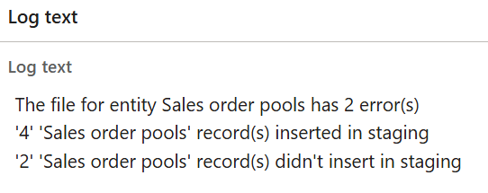

---
lab:
    title: 'Lab 5: Import data using Data Management'
    module: 'Learning Path 05: Migrate data and go live with finance and operations apps'
---

**MB-500: Microsoft Dynamics 365: Finance and Operations Apps Developer**

# Lab 5: Import data using Data Management

# Change Record

<html>
<table><tr><th>Version</th><th>Date</th><th>Change</th></tr>
<tr><td>1.0</td><td>23 Aug 2024</td><td>Initial release</td></tr>
</table>
</html>

# Objective

This lab consists of several exercises.

Requirements are a working development virtual machine (VM) with access to the
finance and operations apps and Microsoft Office Excel.

In the first exercise, you’ll prepare to use Data Management by:

-   Refreshing the entity list.

-   Validating the working directory and access for service accounts.

-   Setting the **Ignore** error to yes to enable data to import with errors to
    a staging table.

-   Setting the **Create error file** to yes.

-   Setting **Remove duplicates** to yes to allow duplicates to import to a
    staging table, but not to have them updated in the table.

In the second exercise, you’ll prepare templates for the Data Management
framework, and then in the third exercise, you’ll import an Excel sheet with
data, which requires an Excel sheet with correct column names.

# Exercise 1: Prepare Data Management parameters

To prepare for configuration of Data Management parameters:

1.  Open Microsoft **Edge** on your VM and then enter
    **https://usnconeboxax1aos.cloud.onebox.dynamics.com/?cmp=USMF** in the
    address field.

2.  Select the **Data management** workspace, and then select the **Framework parameters**.

3.  Select the **Entity settings** tab, and then select **Refresh entity list**
    to refresh data entities in the system. Notice that data entities are now
    updated in the background as an asynchronous job.

    

4.  In the **Framework parameters**, navigate to the **General** tab, and then
    in the **Shared working directory** group, enter **c:\\temp\\dixf** for the
    path.

5.  Select **Validate** to confirm that the service account has access to the
    folder, and then configure the following parameters on the **General** tab,
    then **Save**:

    -   Ignore error: **Yes**

    -   Create error file: **Yes**

    -   Remove duplicates: **Yes**

# Exercise 2: Prepare templates for Data Management

To prepare your templates to use Data Management:

1.  In the **Navigation pane**, select **Workspaces**, select **Data
    management**, and then select the **Templates** tile.

2.  Select the **Load default templates** action pane item.

3.  Find and select **140 – Accounts receivable**, select **Load selected**, and
    then wait for the **140 – Accounts receivable** template to load. When it
    completes you will see entities in the Entities list.

    

4.  In the **Entities** list, select all, and then navigate to **Customer
    groups**, and clear the **Customer groups** entity.

5.  Navigate to **Sales order pools**, clear the **Sales order pools** entity,
    and then select **Remove entity** at the entity list action bar.

6.  Select **Yes** for the **Are you sure you want to delete all marked
    records** option, and then verify that only **Customer groups** and **Sales
    order pools** entities remain:

    

# Exercise 3: Create an import project

To create an import project:

1.  In the **Navigation pane**, select **Workspaces**, and then select **Data
    Management**.

2.  Select the **Export** tile to create an Excel sheet that provides the
    correct naming for columns.

3.  Enter **Group and pool** in the **Group name** field, and then enter
    **Customer group and order pools** in the **Description** field.

4.  In **Selected entities**, select **Add template**, and then in the **Copy
    from template** field, select the **140 – Account receivable** template
    which you created in Exercise 2.

5.  In the **Target data format** field, select **EXCEL**, and then select
    **OK**.

6.  In the upper action pane, select **Export now** and wait to see the
    Execution summary.

1.  Under **Entity processing status**, select **Download file** for **Sales
    order pools**.

2.  For **Entity procession status**, select **Download file** for **Customer
    groups**.

3.  Open **File Explorer** on your VM, and then open the Excel file for **Sales
    order pools**. You can **Close** the Microsoft Office Activation Wizard and
    **Enable Editing**.

1.  Right-click column **A** to open the context menu, select **Format Cells**,
    and select OK.

2.  For row **6**, enter ‘**02** for the **POOLID** column.

3.  For row **6**, enter **My order pool** in the **POOLNAME** column.

4.  For row **7**, enter ‘**05** in the **POOLID** column.

5.  For row **7**, enter **My other order pool** in the **POOLNAME** column
    

6.  Close **Excel** and select **Save** when prompted.

7.  Go back to Microsoft Edge and the finance and operations apps, and in the
    **Navigation pane**, select Workspaces and **Data management**.

8.  Select the **Import** tile, and then enter **Import Group and Pool** in the
    **Group name** field.

9.  Enter **Import Customer group and order pools** in the **Description**
    field.

10. In **Selected entities**, select **Add file**, and then in **Source data
    format**, select **EXCEL**.

11. In **Entity name**, select **Sales order pools**, and then select **Upload
    and add**.

12. Navigate to the **Downloads** folder, and then select the Excel file for
    **Sales order pools**.

13. Select **Customer groups** in **Entity name**, and then select **Upload and
    add**.

14. Navigate to the **Downloads** folder, and then select the **Excel** file for
    **Customer groups**.

15. Select **Close**, and then select **Import now** from the action pane, and wait for the import to finish.
   

1.  Select **View execution log** in the action pane, and then verify in the log
    text that two records didn’t add. This is because of a duplicate.

1.  Open **File Explorer** on your VM, navigate to the **Downloads** folder, and
    then open the Excel file for **Sales order pools**.

2.  On row **6**, enter ‘**06** for the **POOLID**.

3.  Close **Excel**, and then select **Save** when prompted.

4.  Go back to Microsoft Edge and the finance and operations apps, and in the
    navigation pane, select **Workspaces**, and then select **Data management**.

5.  Select the **Import Group and Pool** Data project, select **Remove Entity**
    for removing Sales order pools data entity from the list, and then select
    **Add file**.

6.  The source data format is EXCEL.

7.  In **Entity name**, select **Sales order pools**, and then select **Upload
    and add**.

8.  Navigate to the **Downloads** folder, and then select the Excel file for
    **Sales order pools**.

9.  Select **Close**, and the updated Excel file will be ready to import.

10. Select **Import now**, and then wait for the import to finish.

11. The **Execution Status** should change to **Succeeded**.

12. Select **View execution log**, and then verify that there are no errors.
