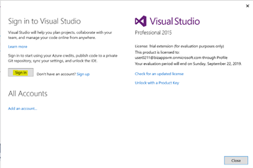
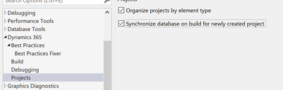
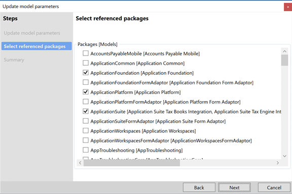
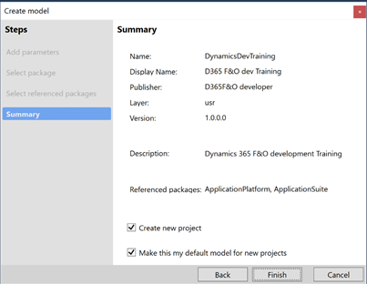
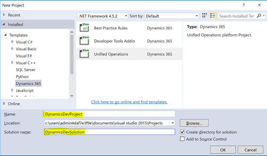

---
lab:
    title: 'Exercise 01: Development environment configuration'
    module: 'Module 01: Overview and architecture'
---

**MB-500: Microsoft Dynamics 365: Finance and Operations Apps Developer**

**Lab 1 – Development Environment Configuration**

Change Record
=============

| Version | Date        | Change                                                                                                                                                                                           |
|---------|-------------|--------------------------------------------------------------------------------------------------------------------------------------------------------------------------------------------------|
| 1.0     | 10 Jan 2020 | Initial release                                                                                                                                                                                  |
| 1.01    | 11 Jun 2020 | Changed link in Lab Environment to be more direct; Removed unclear text from Scenario; Added clarifying instructions                                                                             |
| 1.02    | 22 Jan 2021 | Technical specs: Removed references to LCS, assuming no access; Branding of product name; Accessibility: Removed images when possible, as they don’t translate well in the markdown used by ALHs |
| 1.03    | 29 Jan 2021 | Restored images |

Lab Environment
===============

In order to run this lab, you will need:

-   An all-in-one demo data virtual machine with

    -   Visual Studio installed, and a Visual Studio subscription. These are
        available for free at
        <https://visualstudio.microsoft.com/dev-essentials/>.

Lab Overview
============

-   Open your Dynamics 365 Finance and Operations instance

-   You will configure Visual Studio to do development work for Dynamics 365
    Finance and Operations

-   You will create a new project and model for doing the lab

**Estimated time to complete this lab: 15+ minutes**

Scenario
========

In this lab, we will configure the Visual Studio features to work conveniently
with Dynamics 365 Finance and Operations Apps. We will also create a model and a
project, where we will do most of the development work.

Exercise 1: Open Dynamics 365 Finance and Operations
----------------------------------------------------

1.  Log into your virtual machine using the credentials provided to you

Exercise 2: Configure Visual Studio 
====================================

In this exercise, you will configure Visual Studio in the development VM for
Dynamics 365 Finance and Operations programming.

1.  Search for Visual Studio and open it as administrator. A screen will pop up
    asking you to Sign in to Visual Studio. 
    
    

2.  Select the **Sign in** button, enter your credentials and close the form

3.  Open menu **Dynamics 365 \> Options** in Visual Studio and expand **Text
    Editor**

    Select the **All Languages** node:

    1.  Select the Word wrap check box

    2.  Select the Line numbers check box

        

4.  In the menu **Dynamics 365 \> Options**, expand the **Dynamics 365** node

   Select the **Best Practices** node and make sure the following, under Model:
   Acceptance Test Library – Application Suite, beginning with
   Microsoft.Dynamics.AX.Framework, are checked:

   1.  BestPracticeFramework.UIRules

   2.  CodeStyleRules

   3.  DataAccessRules

   4.  DataEntityRules

   5.  DeprecatedElementsRules

   6.  MaintabilityRules

   7.  StaticCodeValidationRules

5.  In the menu **Dynamics 365 \> Options**, expand the **Dynamics 365** node

    Select the **Projects** node

    1.  Verify that the **Organize projects by element type** check box is
        selected

    2.  Verify that **Synchronize database on build for newly created project**
        check box is selected

6.  Select **OK** to save selections

Exercise 3: Create new Model and Project
========================================

1.  On the Visual Studio menu, click **Dynamics 365**

2.  Select **Model Management \> Create model**

    1.  Model name: DynamicsDevTraining

    2.  Model publisher: D365F&O developer

    3.  Layer usr

    4.  Version 1.0.0.0

    5.  Model description: Dynamics 365 F&O development training

    6.  Model display name: D365 F&O dev training

3.  Click **Next** and select **Create new package** radio button

    

4.  Click **Next** and choose these under **Select referenced packages:**

    1.  Application Foundation

    2.  Application Platform (default selected)

    3.  Application Suite

    4.  ContactPerson

    5.  Directory
    
        

5.  Click **Next** and in the **Summary** screen, check the given options, and
    select **Finish**

    

    1.  Name: DynamicsDevTraining

    2.  Display Name: D365 F&O dev Training

    3.  Publisher: D365F&O developer

    4.  Layer: usr

    5.  Version: 1.0.0.0

    6.  Description: Dynamics 365 F&O Development Training

    7.  Referenced packages: ApplicationFoundation, ApplicationPlatform,
        ApplicationSuite, ContactPerson, Directory

    8.  Create new project: checked

    9.  Make this my default model for new projects: checked

6.  **New Project** pop-up will appear with **Dynamics 365 \> Finance
    Operations** as the default template selected

7.  Provide Project & Solution name as follows and select **OK** button:

    1.  Name: DynamicsDevProject

    2.  Solution name: DynamicsDevSolution

    3.  Create directory for solution: checked

    

8.  Your new project should appear in the Solution Explorer.

    

9.  Right click the project, select **Properties**, and set the value of
    *Company* to USMF. Select **Apply** and **OK**

Check Output
============

Please ensure you have created the model & project in this lab. Nothing else to
check.
