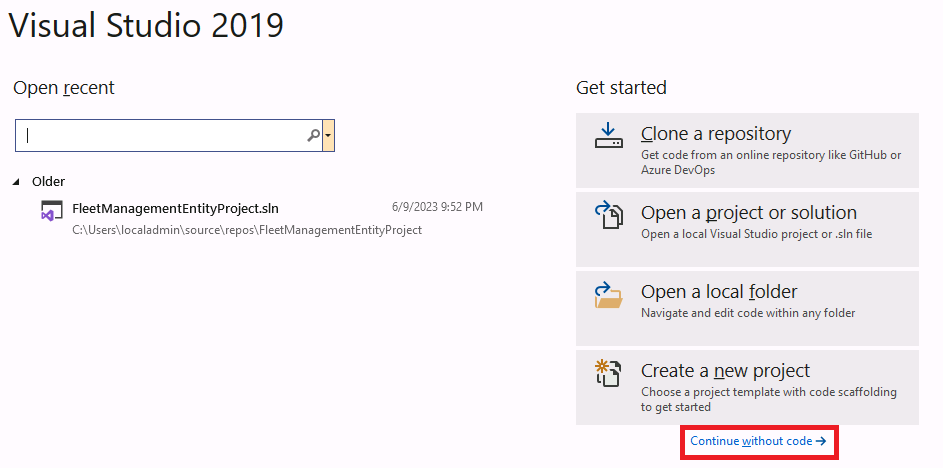
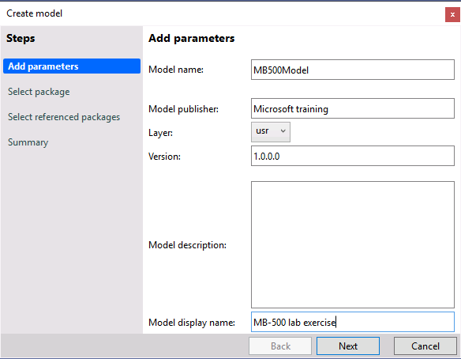
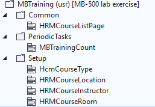
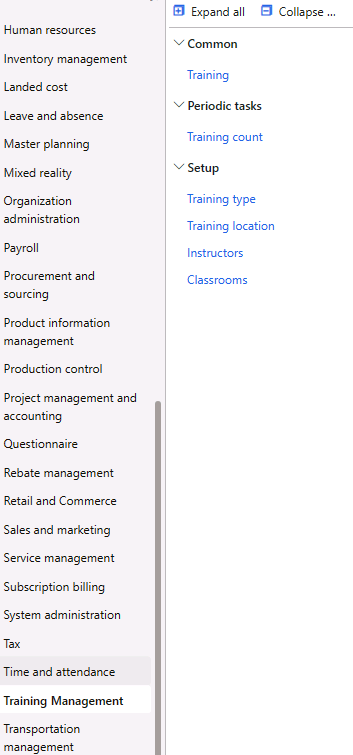

---
lab:
    title: 'Lab 1: Create a new module'
    module: 'Learning Path 01: Introduction to developing with finance and operations apps'
---

**MB-500: Microsoft Dynamics 365: Finance and Operations Apps Developer**

# Change Record

<html>
<table><tr><th>Version</th><th>Date</th><th>Change</th></tr>
<tr><td>1.0</td><td>29 Sep 2023</td><td>Initial release</td></tr>
</table>
</html>

# Objective

This lab consists of several exercises.

The first is basic **setup** in Visual Studio in order to prepare to code.

In the second exercise, we will **create a new module** named **Training
management**. In this module, we will have a few submenus like Common, Periodic
tasks and Setup. We will include the existing Course interface under the Common
submenu. Under the Periodic tasks, we will display the total number of courses
available. Under the Setup submenu, we will include some of the existing
course-related setup pages, like Course type, Course location etc.

In the third, optional, part of the lab, we will create a **new workspace** with
three sections: tile, list and link. In the fourth exercise, we will insert a
**new tile** in the workspace to count the number of open trainings. In the
fifth exercise, we will **insert a grid** in the workspace to display the
courses in the workspace.

# Exercise 1: Create model and project 

1.  Select Visual Studio 2019 from the desktop.

2.  Select **Continue without code** in the popped-up dialog **Visual Studio
    2019.**

3.  Select **Extensions \> Dynamics 365 \> Model management \> Create model**
    and enter the following information to create a new model, then select
    **Next**:

    -   **Model name**: MB500Model

    -   **Model publisher**: Microsoft training

    -   **Layer**: usr

    -   **Version**: 1.0.0.0

    -   **Model display name**: MB-500 lab exercise

        
4.  Select **Create new package** followed by the **Next** button.

    

5.  Select the following referenced packages followed by the **Next** button:

    -   ApplicationFoundation

    -   ApplicationPlatform

    -   PersonnelManagement

6.  In the **Summary** step, check **Create new project** and select the
    **Next** button.

7.  In the **Configure your new project** dialog, type *PrjMb500Lab-1* and
    *SlnMb500Lab* in the **Project name** and **Solution name** fields
    respectively, then select **Create**.

8.  The new solution and project will appear in Solution **Explorer**.

# Exercise 2: Create a new module

## Task 1: Create a new label file

**Note:** *It is a good practice to create a label file in case you need multilingual support for your implementation.*

1.  In the **Solution Explorer** right click on the project *PrjMB500Lab-1.*

2.  Select **Add** \> **New Item.**

3.  Under **Dynamics 365 Items**, select **Labels And Resources** and select
    **Label File**.

4.  In the **Name** field type *MBLabelFile* and select the **Add** button.

5.  Select the **Next** button in the popped up **Label file Wizard (**this
    might take a moment)**.**

6.  Among the list of languages, highlight *en-US* in the **Selected languages**
    list and select the **Next** button.

7.  In the **Summary** step, select the **Next** button.

8.  A new folder **Label Files** will be created in the **Solution Explorer**
    under the project *PrjMB500Lab-1*.

9.  In the **Label Files** folder, a new label file *MBLabelFile_en-US* will
    also be created with single language option *MBLabelFile.en-US.label.txt*. 
**Note:** *You can right click on *MBLabelFile_en-US* and select **Add new Languages** to add additional language in the label file.* 

10. Open *MBLabelFile_en-US* in the **Element designer** pane and add the
    following labels by selecting the **New** button, then **Save All**:

| **Label ID** | **Label** | **Description**  |
|--------------|-------------------------------|-------------------------------|
| MB001        | Training Management           | Module name                   |
| MB002        | Training                      | Training list interface       |
| MB003        | Training type                 | Training type interface       |
| MB004        | Training location             | Training location interface   |
| MB005        | Total number of trainings: %1 | Training count class          |
| MB006        | Training count                | Training count function       |
| MB007        | Analytics                     | Training workspace tab page   |
| MB008        | Open trainings                | Tile description in workspace |

## Task 2: Extend existing display menu items

**Note:** *In this task, we will not create new tables and forms to be displayed in the new module. We will use some forms related to the Course tables and display them in the Training management module. We will change the label of some of the menu items from Course to Training, those will be displayed from the Training management module*

1.  Extend display menu item *HRMCourseListPage:*

    1.  In the (View \> ) **Application Explorer**, select *HRMCourseListPage*
        display menu item under **User Interface**.

    2.  Right-click on *HRMCourseListPage* and select **Create extension**.

    3.  A new folder **Display Menu Item Extensions** will be created in the
        **Solution Explorer** under the project *PrjMB500Lab-1*.

    4.  A new element *HRMCourseListPage.MB500Model* will be created in the
        **Display Menu Item Extensions** folder.

    5.  Open *HRMCourseListPage.MB500Model* in the **Element designer** pane and
        right click on it to select the **Properties** option.

    6.  Locate the **Label** property and select the **three dots (…)** next to
        the **Label** property.

    7.  The label search option will open, where you select **Match exactly** in
        the **Find option** and search for *Training*. (You can also type
        Training in the label field and then hit the ellilpsis, and select
        MB002.)

    8.  Select **Label ID** *MB002* in the results and select the **Paste
        label** button at the bottom.

    9.  The **Label** property should be updated with *\@MBLabelFile:MB002*.

2.  Extend display menu item *HcmCourseType:*

    1.  In the **Application Explorer**, select the *HcmCourseType* display menu
        item.

    2.  Right-click on *HcmCourseType* and select **Create extension**.

    3.  A new element *HcmCourseType.MB500Model* will be created in the
        **Display Menu Item Extensions** folder.

    4.  Open *HcmCourseType.MB500Model* in the **Element designer** pane and
        right click on it to select the **Properties** option.

    5.  Locate the **Label** property and select the **three dots (…)** next to
        the **Label** property.

    6.  Label search option will open, where you select **Match exactly** in the
        **Find option** and search for *Training type*.

    7.  Highlight **Label ID** *MB003* and select **Paste label** button at the
        bottom.

    8.  The **Label** property should be updated with *\@MBLabelFile:MB003.*

3.  Extend display menu item *HRMCourseLocation:*

    1.  In the **Application Explorer**, select *HRMCourseLocation* display menu
        item.

    2.  Right-click on *HRMCourseLocation* and select **Create extension**.

    3.  A new element *HRMCourseLocation.MB500Model* will be created in the
        **Display Menu Item Extensions** folder.

    4.  Open *HRMCourseLocation.MB500Model* in the **Element designer** pane and
        right click on it to select the **Properties** option.

    5.  Locate the **Label** property and select the **three dots (…)** next to
        the **Label** property.

    6.  Label search option will open, where you select **Match exactly** in the
        **Find option** and search for *Training location*.

    7.  Locate **Label ID** *MB004* and select **Paste label** button at the
        bottom.

    8.  The **Label** property should be updated with *\@MBLabelFile:MB004.*

   **4. Save all.**

## Task 3: Create a class

**Note:** *In this task, we will write a simple method to count the total number of records in the Course table*

1.  In the **Solution Explorer** right click on the project *PrjMB500Lab-1.*

2.  Select **Add** \> **New Item.**

3.  Under **Dynamics 365 Items**, select **Code** and select **Runnable Class
    (Job)**.

4.  In the **Name** field type *MBTrainingCount* and select the **Add** button.

5.  A new folder **Classes** will be created in the **Solution Explorer** under
    the project *PrjMB500Lab-1*.

6.  In the **Classes** folder, a new class *MBTrainingCount* will also be
    created.

7.  Open *MBTrainingCount* class in the **Code editor** pane and replace the existing **main()** method (3 lines) with this code, then **Save**:

	
		public static void main(Args _args)
		{
		    HRMCoursetable courseTable; //Define a variable of type HRMCourseTable table, which can hold record set
		    select count(RecId) from courseTable; //X++ based Select statement, which can read data directly from database and hold the data in the variable courseTable. This particular query can fetch the total count of records in the HRMCourseTable table.
		    Info(strFmt("@MBLabelFile:MB005", int2Str(courseTable.RecId))); //Info() is a standard function that can display messages in the finance and operations apps page. The input of this function should be a string. strFmt() is a string function, which is used when constant string value is concatenated with variable values to form a complete string-based statement. By using int2Str() function, we convert the integer value to string, as already mentioned, input parameter of the Info() function is string only.
		}

8.  Save all.

## Task 4: Create an action menu item

**Note:** *An action menu item is required to call a runnable class from a menu. This action item will call the runnable class we created above.*

1.  In the **Solution Explorer** right click on the project *PrjMB500Lab-1.*

2.  Select **Add** \> **New Item.**

3.  Under **Dynamics 365 Items**, select **User Interface** and select **Action
    Menu Item**.

4.  In the **Name** field type *MBTrainingCount* and select the **Add** button.

5.  A new folder **Action Menu Items** will be created in the **Solution
    Explorer** under the project *PrjMB500Lab-1*.

6.  In the **Action Menu Items** folder, a new menu *MBTrainingCount* will also
    be created.

7.  Open *MBTrainingCount* menu in the **Element designer** pane and right click
    on it to select the **Properties** option.

8.  For **Object Type**, select **Class**.

9.  For **Object**, select **MBTrainingCount**.

10. Locate the **Label** property and select the **three dots (…)** next to the
    **Label** property.

11. Label search option will open, where you select **Match exactly** in the
    **Find option** and search for *Training count*.

12. Locate **Label ID** *MB006*, highlight it, and select **Paste label** button
    at the bottom.

13. The **Label** property should be updated with *\@MBLabelFile:MB006.*

14. **Save all.**

## Task 5: Create a new menu

**Note:** *In this task, we will create the menus and submenus of the new module. We will also connect the menu items with the submenus in this section*

1.  In the **Solution Explorer** right click on the project *PrjMB500Lab-1.*

2.  Select **Add** \> **New Item.**

3.  Under **Dynamics 365 Items**, select **User Interface** and select **Menu**.

4.  In the **Name** field type *MBTraining* and select the **Add** button.

5.  A new folder **Menus** will be created in the **Solution Explorer** under
    the project *PrjMB500Lab-1*.

6.  In the **Menus** folder, a new menu *MBTraining* will also be created.

7.  Open the *MBTraining* menu in the **Element designer** pane and right click
    on it to select the **Properties** option.

8.  Locate the **Label** property and select the **three dots (…)** next to the
    **Label** property.

9.  Label search option will open, where you select **Match exactly** in the
    **Find option** and search for *Training management*.

10. Select **Label ID** *MB001* and select **Paste label** button at the bottom.

11. The **Label** property should be updated with *\@MBLabelFile:MB001.*

12. Right-click the *MBTraining* menu in the Element designer and select the
    **New \> Submenu** option to create the following **Submenus**. Each
    **Submenu** will have one or more **menu items** as children. You can drag
    the **menu items** from **Application explorer** and drop them on the
    respective **submenus**.

    1.  Submenu **Name:** Common

        **Label:** Common (\@SYS26806)

        Add Display menu item:

        -   HRMCourseListPage

    2.  Submenu **Name:** PeriodicTasks

        **Label:** Periodic tasks (\@SYS76406)

        Add Action menu item:

        -   MBTrainingCount

    3.  Submenu **Name:** Setup

        **Label:** Setup (\@SYS12687)

        Add Display menu items:

        -   HCMCourseType

        -   HRMCourseLocation

        -   HRMCourseInstructor

        -   HRMCourseRoom

**Note:** *The MBTraining menu should consist of a Common submenu with one form, a PeriodicTasks submenu with one form, and a Setup submenu with four forms.*

13. Save all.

## Task 6: Extend an existing menu 

**Note:** *This section helps to connect the new module with the existing list of modules available in the finance and operations apps.*

1.  In the **Application Explorer**’s User Interface, select the menu
    *MainMenu*.

2.  Right-click on *MainMenu* and select **Create extension**.

3.  A new folder **Menu Extensions** will be created in the **Solution
    Explorer** under the project *PrjMB500Lab-1*.

4.  A new element *MainMenu.MB500Model* will be created in the **Menu
    Extensions** folder.

5.  Open *MainMenu.MB500Model* in the **Element designer** pane and right click
    on it to create a **Menu reference** under **New**.

6.  Select the newly created **Menu reference** and navigate to the
    **Properties** option by right clicking on it.

7.  Select *MBTraining* in both **Name** and **Menu Name** property of the newly
    created **Menu item reference.**

8.  **Save all.**

## Task 7: Test

1.  In the **Solution Explorer** right click on the project *PrjMB500Lab-1.*

2.  Select **Build.**

3.  Once the build is successful, navigate to the finance and operations apps
    page on your browser and refresh the page.

4.  Select legal entity **USMF**.

5.  After refreshing, you should be able to see a new module named “Training
    management” in the left pane.

6.  The module should have three sub menus: **Common**, **Periodic tasks** and
    **Setup**.

    

7.  Select **Training count** under the **Periodic tasks** submenu. You should
    get an info message “*Total number of trainings: 9*”.

# Optional exercise 3: Create and set up a new workspace

## Task 1: Create a new workspace

**Note:** *We will create a workspace to display focused training data, where we will create three sections: tile, list and link. In this section we will add few links in the workspace that will take you to the respective course related setup page.*

1.  In the **Solution Explorer** right click on the project *PrjMB500Lab-1.*

2.  Select **Add** \> **New Item.**

3.  Under **Dynamics 365 Items**, select **User Interface** and select **Form**.

4.  In the **Name** field type *MBTrainingWorkspace* and select the **Add**
    button.

5.  A new folder **Forms** will be created in the **Solution Explorer** under
    the project *PrjMB500Lab-1*.

6.  In the **Forms** folder, a new form *MBTrainingWorkspace* will also be
    created.

7.  Open the *MBTrainingWorkspace* form in the **Element designer** pane.

8.  Right-click on Design node and **Apply pattern Workspace Tabbed**.

9.  Navigate to the properties of the Design node and change the caption to
    **Training management** (Label ID: MB001).

10. Right-click on the Design node and insert a new Tab.

11. Rename the tab to **TrainingWorkspace**.

12. Insert two tab pages on the tab TrainingWorkspace: Summary and Analytics
    with the same captions in the properties (Label IDs: \@SYS15560 and
    \@MBLabelFile:MB007 consecutively).

13. Navigate to the properties of the Analytics tab page and change the Hide if Empty property to No.
  **Note:** *In this task, we will not add any content in the Analytics tab page. The No value in the Hide if Empty property will ensure the Analytics tab page will be displayed even if it is empty.*

14. Insert a new tab under the Summary tab page and rename the tab to
    PanoramaBody.

15. Navigate to the property pane of the **PanoramaBody** tab and change the
    following properties:

-   Extended Style: tab_simpleFastTab

-   Style: FastTabs

-   Allow Edit: No

    1.  Right-click on the **PanoramaBody** tab and insert three tab pages as
        follows:

        1.  Name: SummaryTileSection

            **Apply pattern Section Tiles**

            Caption (property): Summary (Label ID: \@SYS15560)

            Fast Tab Expanded (property): Yes

            Hide If Empty (property): No

        2.  Name: TabbedListSection

            **Apply pattern Section Tabbed List**

            Caption (property): Training (Label ID: \@MBLabelFile:MB002)

            Extended Style: workspace_tileLayout

            Fast Tab Expanded (property): Yes

            Hide If Empty (property): No

        3.  Name: LinkSection

            **Apply pattern Section Related Links**

            Caption (property): Link (Label ID: \@SYS57785)

            Extended Style: workspace_tileLayout

            Fast Tab Expanded (property): Yes

    2.  Under the LinkSection tab page, insert a **Group** named
        **TrainingSetupLinks** with the following property:

        1.  Caption: Setup (Label ID: \@SYS12687)

    3.  Under the TrainingSetupLinks group, insert two Menu Item Buttons

        1.  Name: **CourseType** (Menu Item Name (property): **HcmCourseType**)

        2.  Name: **CourseLocation** (Menu Item Name (property):
            **HRMCourseLocation**)

## Task 2: Create a new Resource

**Note:** *In this section, we will create a resource containing an image that will be designed for the workspace.*

1.  In the **Solution Explorer** right click on the project *PrjMB500Lab-1.*

2.  Select **Add** \> **New Item.**

3.  Under **Dynamics 365 Items**, select **Labels And Resources** and select
    **Resource**.

4.  In the **Name** field type *MBTraining* and select the **Add** button.

5.  A pop up will appear asking to Select a Resource file. Select Training.png
    from your lab resources, or download it from
    https://aka.ms/mb500labresources

6.  A new folder **Resources** will be created in the **Solution Explorer**
    under the project *PrjMB500Lab-1*.

7.  In the **Resources** folder, a new resource *MBTraining* will also be
    created.

## Task 3: Create a new Display menu item

1.  In the **Solution Explorer** right click on the project *PrjMB500Lab-1.*

2.  Select **Add** \> **New Item.**

3.  Under **Dynamics 365 Items**, select **User Interface** and select **Display
    Menu Item**.

4.  In the **Name** field type *MBTrainingManagement* and select the **Add**
    button.

5.  A new folder **Display Menu Items** will be created in the **Solution
    Explorer** under the project *PrjMB500Lab-1*.

6.  In the **Display Menu Items** folder, a new display menu item
    *MBTrainingManagement* will also be created.

7.  Open *MBTrainingManagement* display menu item in the **Element designer**
    pane and navigate to the properties pane and update the following:

    1.  Label: Training management (Label ID: MBLabelFile:MB001)

    2.  Object: MBTrainingWorkspace

    3.  Subscriber access level: Unset

## Task 4: Create a new Tile

1.  In the **Solution Explorer** right click on the project *PrjMB500Lab-1.*

2.  Select **Add** \> **New Item.**

3.  Under **Dynamics 365 Items**, select **User Interface** and select **Tile**.

4.  In the **Name** field type *MBTrainingWorkspace* and select the **Add**
    button.

5.  A new folder **Tiles** will be created in the **Solution Explorer** under
    the project *PrjMB5.00Lab*.

6.  In the **Tiles** folder, a new tile *MBTrainingWorkspace* will also be
    created.

7.  Open the *MBTrainingWorkspace* tile in the **Element designer** pane and
    navigate to the properties pane and update the following:

    1.  Size: Wide

    2.  Image location: AOTResource

    3.  Menu Item Name: MBTrainingManagement

    4.  Normal Image: MBTraining

    5.  Tile display: BackgroundImage

## Task 5: Modify the existing training menu

**Note:** *In the existing menu created for the Training management module, we will create a new submenu to display the workspace. The menu items and tiles created in the earlier sections, are required for that only.*

1.  In the **Solution Explorer**, select MBTraining under the Menus folder.

2.  Right-click on MBTraining and create a new Submenu **Workspace** by
    selecting New \> Submenu with the same label as Workspace (Label ID:
    \@SYS121871).

3.  Position Workspace as the first submenu before Common (Hint: Use Alt-arrow
    to move elements).

4.  Right-click on the Workspace submenu and insert a new Menu Element Tile
    named **MBTrainingWorkspace**.

5.  Select **MBTrainingWorkspace** in the **Tile** property of the Menu Element
    Tile.

## Task 6: Extend an existing menu 

**Note:** *In this section, we will extend the standard menu named navpanemenu. This is required to include the newly created workspace in the landing page of finance and operations apps.*

1.  In the **Application Explorer**, select the (User Interface \> ) menu
    *navpanemenu*.

2.  Right-click on *navpanemenu* and select **Create extension**.

3.  A new element *navpanemenu.MB500Model* will be created in the **Menu
    Extensions** folder.

4.  Open *navpanemenu.MB500Model* in the **Element designer** pane and right
    click on it to create a **Menu Element Tile** under **New**.

5.  Select the newly created **Menu Element Tile** and navigate to the
    **Properties** option by right clicking on it.

6.  Select *MBTrainingWorkspace* in both **Name** and **Tile** property of the
    newly created **Menu Element Tile.**

## Task 7: Test

1.  In the **Solution Explorer** right click on the project *PrjMB500Lab-1.*

2.  Select **Build.**

3.  Once the build is successful, navigate to the finance and operations apps
    page on your browser and refresh the page.

4.  Select legal entity **USMF**.

5.  After refreshing, you should be able to see the new workspace Training
    management in the landing page with the image you selected.

6.  You should also be able to access the Training management workspace from
    Module \> Training management \> Workspace.

7.  Within the new workspace, there will be two tab pages: Summary and
    Analytics.

8.  The Analytics tab page is empty.

9.  In the Summary tab page, there should be three sections: Summary, Training
    and Link.

10. In the Link section, under the SETUP group, there should be links to two
    forms: Training type and Training location.

# Optional exercise 4: Add a tile in the Summary Tile Section

**Note:** *This is an optional exercise. In this exercise you will add a tile to the summary tile section. The tile will contain the count of open courses. On selecting the tile, you will navigate to the course page that will display only the open courses.*

## Task 1: Create a new Query

1.  In the **Solution Explorer** right click on the project *PrjMB500Lab-1.*

2.  Select **Add** \> **New Item.**

3.  Under **Dynamics 365 Items**, select **Data Model** and select **Query**.

4.  In the **Name** field type *MBTraining_Open* and select the **Add** button.

5.  A new folder **Simple Queries** will be created in the **Solution Explorer**
    under the project *PrjMB500Lab-1*.

6.  In the **Simple Queries** folder, a new query *MBTraining_Open* will also be
    created.

7.  Open *MBTraining_Open* query in the **Element designer** pane.

8.  From the Application explorer, select the table HRMCourseTable in the Data
    Model and drag on the Data Sources node of the MBTraining_Open query.

9.  Change the Dynamic Fields property of the HRMCourseTable data source to Yes.

10. Add the field **status** under the **Ranges** node of the HRMCourseTable
    data source.

11. Change the Value property of the status field included in the Ranges node to
    **Open.**

## Task 2: Create a new Display Menu Item

1.  In the **Solution Explorer** right click on the project *PrjMB500Lab-1.*

2.  Select **Add** \> **New Item.**

3.  Under **Dynamics 365 Items**, select **User Interface** and select **Display
    Menu Item**.

4.  In the **Name** field type *MBTraining_Open* and select the **Add** button.

5.  In the **Display Menu Items** folder, a new display menu item
    *MBTraining_Open* will also be created.

6.  Open the *MBTraining_Open* display menu item in the **Element designer**
    pane and navigate to the properties pane and update the following:

    1.  Label: Open trainings (Label ID: MBLabelFile:MB008)

    2.  Form View Option: Grid

    3.  Object: HRMCourseTable

    4.  Query: MBTraining_Open

    5.  Subscriber access level: Unset

## Task 3: Create a new Tile

1.  In the **Solution Explorer** right click on the project *PrjMB500Lab-1.*

2.  Select **Add** \> **New Item.**

3.  Under **Dynamics 365 Items**, select **User Interface** and select **Tile**.

4.  In the **Name** field type *MBOpenTrainingTile* and select the **Add**
    button.

5.  In the **Tiles** folder, a new tile *MBOpenTrainingTile* will also be
    created.

6.  Open *MBOpenTrainingTile* tile in the **Element designer** pane and navigate
    to the properties pane and update following:

    1.  Label: Open trainings (Label ID: \@MBLabelFile: MB008)

    2.  Menu Item Name: MBTraining_Open

    3.  Type: Count [This will show the number of open trainings on the tile
        itself]

## Task 4: Modify the form MBTrainingWorkspace

1.  In the **Solution Explorer**, select MBTrainingWorkspace under the Forms
    folder.

2.  Navigate to Design \> TrainingWorkspace (tab) \> Summary (tab page) \>
    PanoramaBody (tab) \> SummaryTileSection (tab page).

3.  Insert a new Tile Button under SummaryTileSection tab page with the
    following properties:

    1.  Name: OpenTrainingTile

    2.  Tile: MBOpenTrainingTile

## Task 5: Test

1.  In the **Solution Explorer** right click on the project *PrjMB500Lab-1.*

2.  Select **Build.**

3.  When the build is successful, navigate to the finance and operations apps
    page on your browser and refresh the page.

4.  Select the legal entity USMF.

5.  Open the Training management workspace.

6.  You will find a tile under the Summary section of the Summary tab page. (The
    count may not be visible yet but it will be after the next step.)

7.  The tile will take you to the Course page displaying only the Open courses.

# Optional exercise 5: Add a list in the Tabbed List Section

**Note:** *This is an optional lab. In this lab, you will display the list of courses in the tabbed list section of the workspace.*

## Task 1: Create a new Form

1.  In the **Solution Explorer** right click on the project *PrjMB500Lab-1.*

2.  Select **Add** \> **New Item.**

3.  Under **Dynamics 365 Items**, select **User Interface** and select **Form**.

4.  In the **Name** field type *MBTrainingFormPart* and select the **Add**
    button.

5.  In the **Forms** folder, a new form *MBTrainingFormPart* will also be
    created.

6.  Open *MBTrainingxFormPart* form in the **Element designer** pane.

7.  From the Application explorer, select the table HRMCourseTable in the Data
    Model and drag it onto the Data Sources node of the MBTrainingFormPart form.

8.  Change the Insert If Empty property of the HRMCourseTable data source to No.
  **Note:** *The Yes value in the Insert If Empty property of data source makes sure, if the table does not have any records, the system will create a blank record when the page is opened. The workspace is for display only. We do not need to create a record in the workspace, so the value of this property is set to No. This will ensure, if the table does not have any data, the system will not create a blank record to be displayed on the page.*

9.  Select the Design node of the MBTrainingFormPart form and Apply pattern Form
    Part Section List.

10. Under the Design node, insert a Grid with a name of **Grid**.

11. Select the following fields from the HRMCourseTable Data Source and drag
    them over the newly created Grid:

    1.  hrmCourseId

    2.  CourseType

    3.  Description

    4.  StartDateTime

    5.  EndDateTime

## Task 2: Create a new Display Menu Item

1.  In the **Solution Explorer** right click on the project *PrjMB500Lab-1.*

2.  Select **Add** \> **New Item.**

3.  Under **Dynamics 365 Items**, select **User Interface** and select **Display
    Menu Item**.

4.  In the **Name** field type *MBTrainingFormPart* and select the **Add**
    button.

5.  In the **Display Menu Items** folder, a new display menu item
    *MBTrainingFormPart* will also be created.

6.  Open *MBTrainingxFormPart* display menu item in the **Element designer**
    pane and navigate to the properties pane and update the following:

    1.  Object: MBTrainingFormPart

## Task 3: Modify the form MBTrainingWorkspace

1.  In the **Solution Explorer**, select MBTrainingWorkspace under the Forms
    folder.

2.  Navigate to Design \> TrainingWorkspace (tab) \> Summary (tab page) \>
    PanoramaBody (tab) \> TabbedListSection (tab page).

3.  Under tab page TabbedListSection, insert a new tab named TabbedList.

4.  Under the tab TabbedList, insert a new tab page named Training with the
    caption **Training** (Label ID: \@MBLabelFile:MB002).

5.  Under the tab page Training, insert a new **Form Part** with the following
    properties:

    1.  Name: TrainingFormPart

    2.  MenuItemName: MBTrainingFormPart

    3.  Run Mode: Local

## Task 4: Test

1.  In the **Solution Explorer** right click on the project *PrjMB500Lab-1.*

2.  Select **Build.**

3.  When the build completes, navigate to the finance and operations apps page
    on your browser and refresh the page.

4.  Select legal entity **USMF**.

5.  Open the Training management workspace.

6.  You will find the Training tab page under the Training section of the
    Summary tab page, which displays all the Courses.
