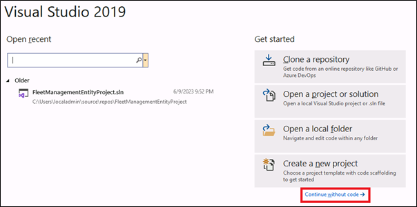

---
lab:
    title: 'Lab 3: Create a custom workflow on the Positions form'
    module: 'Learning Path 03: Connect to finance and operations apps'
---

**MB-500: Microsoft Dynamics 365: Finance and Operations Apps Developer**

# Change Record

<html>
<table><tr><th>Version</th><th>Date</th><th>Change</th></tr>
<tr><td>1.0</td><td>29 Sep 2023</td><td>Initial release</td></tr>
</table>
</html>

# Objective

In standard finance and operations apps, there is no workflow for the Positions
page in the Human resource module. In this lab, we will enable workflow for the
Positions page by creating custom workflow.

This lab consists of several exercises. The first exercise is basic **setup** in
Visual Studio in order to prepare to code. From exercise 2 to 6, we will create
different components required to enable workflow for the position entity.

# Exercise 1: Create model and project 

1.  Run Visual Studio 2019 from the desktop.

2.  Select **Continue without code** in the popped-up dialog **Visual Studio
    2019.** Navigate to Tools \> Options \> Dynamics 365 \> Projects and make
    sure **Synchronize database on build...** is checked.

**Note:** *You can check if there is already a model created named *MB500Model*. If not, please continue from step 7 to step 12. If the model is already present, execute step 3 to step 6.*

3.  Open **Solution Explorer**.

4.  Right click on the solution *SlnMb500Lab*.

5.  Select **Add \> New project**.

6.  Type *PrjMb500Lab-3* as the name of the new project.

7.  Select **Extensions \> Dynamics 365 \> Model management \> Create model**
    and enter the following information to create a new model, then select
    **Next**:

    -   **Model name**: MB500Model

    -   **Model publisher**: Microsoft training

    -   **Layer**: usr

    -   **Version**: 1.0.0.0

    -   **Model display name**: MB-500 lab exercise

        

8.  Select **Create new package** followed by the **Next** button.

    

7.  Select the following referenced packages followed by the **Next** button:

    -   ApplicationFoundation

    -   ApplicationPlatform

    -   PersonnelCore

    -   PersonnelManagement

8.  In the **Summary** step, check **Create new project** and select the
    **Next** button.

9.  In the **Configure your new project** dialog, enter *PrjMb500Lab-3* and
    *SlnMb500Lab* in the **Project name** and **Solution name** fields
    respectively, then select **Create**.

10. The new solution and project will appear in **Solution Explorer**.

# Exercise 2: Working with data types

## Task 1: Create a new base enum – MBPositionWFStatus

**Note:** *This based enum should be added in the Position record that will identifies the workflow status of the position record.*

1.  In the **Solution Explorer,** right click on the project *PrjMB500Lab-3.*

2.  Select **Add** \> **New Item.**

3.  Under **Dynamics 365 Items**, select **Data Types** and select **Base
    Enum**.

4.  In the **Name** field type *MBPositionWFStatus* and select the **Add**
    button.

5.  A new folder **Base Enums** will be created in the **Solution Explorer**
    under the project *PrjMB500Lab-3*.

6.  In the **Base Enums** folder, a new element *MBPositionWFStatus* will also
    be created.

7.  Open the *MBPositionWFStatus* in the **Element designer** pane and right
    click on it to select the **Properties** option.

8.  Type *Workflow status* in the **Label** property.
**Note:** *Ideally, the labels should be added in the label file for best practice, as practiced in Lab 1.*

9.  Right click on *MBPositionWFStatus* in the designer and select **New
    Element**

10. Create seven **Base Enum elements** with names and labels of *Created*,
    *Submitted*, *Approved*, *Rejected*, *Requested*, *Cancelled* and
    *Completed*.

# Exercise 3: Working with Data models

## Task 1: Extend the existing table – HcmPosition

**Note:** *We are extending the HcmPosition table to add the workflow status (created in the previous exercise) to the HcmPosition table.*

1.  In the (View \> ) **Application Explorer**, select the *HcmPosition* table
    under **Data Model**.

2.  Right-click on the *HcmPosition* table and select **Create extension**.

3.  A new folder **Table Extensions** will be created in the **Solution
    Explorer** under the project *PrjMB500Lab-3*.

4.  A new element *HcmPosition.MB500Model* will be created in the **Table
    Extensions** folder.

5.  Open *HcmPosition.MB500Model* in the **Element designer** pane.

6.  Drag the *MBPositionWFStatus* base enum from the **Solution Explorer** and
    drop it under the *Fields* node under *HcmPosition.MB500Model*.

7.  Drag the *MBPositionWFStatus* field from the **Fields** node of the
    *HcmPosition* table and drop it on the *Identification* **Field group**. The
    new field *MBPositionWFStatus* is added in the field group *Identification*
    along with the existing field *PositionId.*

    **Note:** *Now, forms which display the Identification field group will display this new status field.*

## Task 2: Create a new Query – MBPositionQuery

**Note**: *This query will be associated to the workflow type later in the lab. The associated query will access the table fields for the workflow document.*

1.  **Save all.** Right click on the project in Solution Explorer and select
    **Build**.

2.  In the **Solution Explorer,** right click on the project *PrjMB500Lab-3.*

3.  Select **Add** \> **New Item.**

4.  Under **Dynamics 365 Items**, select **Data Model** and select **Query**.

5.  In the **Name** field type *MBPositionQuery* and select the **Add** button.

6.  A new folder **Simple Queries** will be created in the **Solution Explorer**
    under the project *PrjMB500Lab-3*.

7.  In the **Simple Queries** folder, a new element *MBPositionQuery* will also
    be created.

8.  Open the *MBPositionQuery* form in the **Element designer** pane.

9.  From the (View \> ) **Application Explorer**, drag the *HcmPosition* table
    under **Data Model** and drop it on the **Data Sources** node of the
    *MBPositionQuery.*

10. Navigate to the property pane of the **HcmPosition Data Sources** and change
    the **Dynamic Fields** property to *Yes*. This will include all the fields
    under the **Fields** node of the **HcmPosition** Data Sources. Verify that
    you see the MBPositionWFStatus, and change the **Dynamic Fields** property
    to *No*.

# Exercise 4: Working with Business Process and Workflow

## Task 1: Create a new workflow category – MBPositionWFCategory

**Note**: *The workflow category determines whether the workflow type is available in a specific module. We will define the Human resource as the module of the custom workflow category.*

1.  In the **Solution Explorer** right click on the project *PrjMB500Lab-3.*

2.  Select **Add** \> **New Item.**

3.  Under **Dynamics 365 Items**, select **Business Process and Workflow** and
    select **Workflow Category**.

4.  In the **Name** field type *MBPositionWFCategory* and select the **Add**
    button.

5.  A new folder **Workflow Categories** will be created in the **Solution
    Explorer** under the project *PrjMB500Lab-3*.

6.  In the **Workflow Categories** folder, a new element *MBPositionWFCategory*
    will also be created.

7.  Open the *MBPositionWFCategory* in the **Element designer** pane and right
    click on it to select the **Properties** option.

8.  Navigate to the property pane of the *MBPositionWFCategory* and enter the
    following properties:

    1.  **Module**: *HumanResource*

    2.  **Label**: *Position workflow category*

## Task 2: Create a new workflow type – MBPositionWFType

**Note:** *To make the workflow process available for a workflow enabled entity, you must create the workflow types that are used in the workflow configuration user interface. You need to specify the workflow category, query and position menu item while defining the workflow type.*

1.  **Save all.** In the **Solution Explorer** right click on the project
    *PrjMB500Lab-3.*

2.  Select **Add** \> **New Item.**

3.  Under **Dynamics 365 Items**, select **Business Process and Workflow** and
    select **Workflow Type**.

4.  In the **Name** field type *MBPositionWFType* and select the **Add** button.

5.  A **Workflow Type** dialog will popup, where you enter the following and
    select the **Next** button.

    1.  **Category**: *MBPositionWFCategory*

    2.  **Query**: *MBPositionQuery*

    3.  **Document menu item**: *HcmPositionList*

6.  The following screen will provide you with the list of elements to be
    created. You need to select the **Next** button in this screen. If you get
    an **Add New Item** dialog, **Cancel** it.

7.  A new folder **Workflow Types** will be created in the **Solution Explorer**
    under the project *PrjMB500Lab-3*.

8.  In the **Workflow Types** folder, a new element *MBPositionWFType* will also
    be created.

9.  Open the *MBPositionWFType* in the **Element designer** pane and right click
    on it to select the **Properties** option.

10. Change the **Label** property to *Position workflow.*

11. Note the new objects created:
		
	A new folder **Action Menu Items** will be created in the **Solution Explorer** under the project *PrjMB500Lab-3*.
		
	In the **Action Menu Items** folder, a new element *MBPositionWFTypeCancelMenuItem* will be created.
	
	In the **Action Menu Items** folder, a new element *MBPositionWFTypeSubmitMenuItem* will be created.
	
	A new folder **Classes** will be created in the  **Solution Explorer** under the project *PrjMB500Lab-3*.
	
	In the **Classes** folder, a new element  *MBPositionWFTypeEventHandler* will be created.
	
	In the **Classes** folder, a new element  *MBPositionWFTypeDocument* will be created.
	
	In the **Classes** folder, a new element *MBPositionWFTypeSubmitManager* will be created.

## Task 3: Create a new workflow approval – MBPositionWFApproval

**Note**: *This workflow element is responsible for creating approval process of a workflow. It helps to create several steps and actions in the approval process; like approve, reject, request change etc.*

1.  **Save all.** In the **Solution Explorer** right click on the project
    *PrjMB500Lab-3* and **Build**

2.  Right click again and select **Add** \> **New Item.**

3.  Under **Dynamics 365 Items**, select **Business Process and Workflow** and
    select **Workflow Approval**.

4.  In the **Name** field type *MBPositionWFApproval* and select the **Add**
    button.

5.  A **Workflow Approval** dialog will popup, where you enter the following and
    select the **Next** button.

    1.  **Workflow document**: *MBPositionWFTypeDocument*

    2.  **Document preview field group**: *Identification*

    3.  **Document menu item**: *HcmPositionList*

6.  The following screen will provide you with the list of elements to be
    created. You need to select the **Next** button in this screen.

7.  A new folder **Workflow Approvals** will be created in the **Solution
    Explorer** under the project *PrjMB500Lab-3*.

8.  In the **Workflow Approvals** folder, a new element *MBPositionWFApproval*
    will also be created.

9.  Open the *MBPositionWFApproval* in the **Element designer** pane and right
    click on it to select the **Properties** option.

10. Change the **Label** property to *Position approval.*

11. Note the new elements created:

	In the **Action Menu Items** folder, a new element *MBPositionWFApprovalApprove* will be created.
	
	In the **Action Menu Items** folder, a new element *MBPositionWFApprovalDelegateMenuItem* will be created.
	
	In the **Action Menu Items** folder, a new element *MBPositionWFApprovalReject* will be created.
	
	In the **Action Menu Items** folder, a new element *MBPositionWFApprovalRequestChange* will be created.
	
	In the **Action Menu Items** folder, a new element *MBPositionWFApprovalResubmitMenuItem* will be  created.
	
	In the **Classes** folder, a new element *MBPositionWFApprovalEventHandler* will be created.
	
	In the **Classes** folder, a new element *MBPositionWFApprovalResubmitActionMgr* will be created.

## Task 4: Update workflow type – MBPositionWFType

**Note:** *This step associates the workflow approval element with the workflow type.*

1.  **Save all.** Open the *MBPositionWFType* in the **Element designer** pane
    from the **Workflow Types** folder of the **Solution Explorer.**

2.  Right click on the **Supported Elements** node of *MBPositionWFType* and
    select **New Workflow Element Reference**

3.  Navigate to the property pane of the newly created workflow element
    reference and change both the **Name** and **Element Name** property to
    *MBPositionWFApproval*.

# Exercise 5: Working with User interfaces

## Task 1: Extend the existing form HcmPosition

**Note:** *In this task, we will add the workflow status field in the positions page. Also we will make the positions page workflow enabled by changing the properties.*

1.  **Save all** and **Build** the project. In the (View \> ) **Application
    Explorer**, select the *HcmPosition* form under **User Interface**.

2.  Right-click on *HcmPosition* form and select **Create extension**.

	3.  A new folder **Form Extensions** will be created in the **Solution
	    Explorer** under the project *PrjMB500Lab-3*.
	
	4.  A new element *HcmPosition.MB500Model* will be created in the **Form
	    Extensions** folder.

5.  Open *HcmPosition.MB500Model* in the **Element designer** pane.

6.  Locate the *MBPositionWFStatus* field in the *HcmPosition* data source. In
    case you cannot find the field, right click on the *HcmPosition* data source
    and select the **Restore** button.

7.  Drag the *MBPositionWFStatus* field and drop it under *Design \> Tab \>
    DetailsPanel \> FastTabs \> DetailsTabPage*.

8.  Select the newly created field *HcmPosition_MBPositionWFStatus* and change
    the **Allow Edit** property to *No*.

9.  Navigate to the property pane of the **Design** root node and enter the
    following properties:

    1.  **Workflow enabled**: *Yes*

    2.  **Workflow Data Source**: *HcmPosition*

    3.  **Workflow Type**: *MBPositionWFType*

## Task 2: Update action menu item

1.  Open the following action menu items in the Element designer pane.

2.  Navigate to the Label property and change the labels as mentioned below.

<table>
<tr><th>Action Menu Item</th><th>Label</th></tr>
<tr><td>MBPositionWFApprovalApprove</td><td>Approve</td></tr>
<tr><td>MBPositionWFApprovalDelegateMenuItem</td><td>Delegate</td></tr>
<tr><td>MBPositionWFApprovalReject</td><td>Reject</td></tr>
<tr><td>MBPositionWFApprovalRequestChange</td><td>Change request</td></tr>
<tr><td>MBPositionWFApprovalResubmitMenuItem</td><td>Resubmit</td></tr>
<tr><td>MBPositionWFTypeCancelMenuItem</td><td>Cancel</td></tr>
<tr><td>MBPositionWFTypeSubmitMenuItem</td><td>Submit</td></tr>
</table>

# Exercise 6: Working with Code

## Task 1: Create a new class – MBPositionTable_Extension

**Note:** *CanSubmitToWorkflow() is a standard method of any table, which is extended using Chain of command to allow the submission of the record to workflow if the Position record is in the Created status. UpdateWorkflowStatus() is a custom method added in the HcmPosition table that will update the workflow status. InitValue() is a standard method of any table, which is extended using Chain of command to initialize the MBPositionWFStatus field with Created, when a new record is being added in the Position table.*

1.  In the **Solution Explorer,** right click on the project *PrjMB500Lab-3.*

2.  Select **Add** \> **New Item.**

3.  Under **Dynamics 365 Items**, select **Code** and select **Class**.

4.  In the **Name** field type *MBPositionTable_Extension* and select the
    **Add** button.

5.  In the **Classes** folder, a new element *MBPositionTable_Extension* will be
    created.

6.  Open the class *MBPositionTable_Extension* in the **Code Editor** pane and
    replace the existing class signature with the following:

		[ExtensionOf(tableStr(HcmPosition))] final class MBPositionTable_Extension

7.  Extend the standard table method canSubmitToWorkflow() by adding a chain of
    command. Add the following method in the class:

		public boolean canSubmitToWorkflow(str _workflowType)
		{
				boolean ret; 
				ret = next canSubmitToWorkflow(_workflowType); //This statement calls the parent method 
				ret = this.RecId != 0 && this.MBPositionWFStatus == MBPositionWFStatus::Created; //This code returns true if the current record of the HcmPosition table has workflow status as Created.
				return ret; 
		}

8.  Add updateWorkflowStatus() method to the class that will be responsible for
    updating the workflow status of the *HcmPosition* table.

		public static void updateWorkflowStatus(RefRecId recId , MBPositionWFStatus status) 
		{ 
			HcmPosition position; 
			ttsbegin; //The code below updates the Workflow status field of the HcmPosition table 
			select forupdate position 
				where position.RecId == recId; 
			position.MBPositionWFStatus = status; 
			position.update(); 
			ttscommit; 
		} 

9.  Create a chain of command of the initValue() method to initialize the
    *MBPositionWFStatus* field while new position is entered in the system.

		void initValue() 
		{ 
			next initValue(); //This statement calls the parent method 
			this.MBPositionWFStatus = MBPositionWFStatus::Created; //	Updates the workflow status field of the HcmPosition table to Created, when new record is added in the HcmPosition table 
		}

## Task 2: Update the class – MBPositionWFTypeEventHandler

**Note:** *In this class, you can write code that will guide the workflow based on actions like started, cancelled and completed.*

1.  Open the *MBPositionWFTypeEventHandler* class in the **Code Editor** pane
    from the **Classes** folder of the **Solution Explorer.**

2.  There are three blank methods which are already created in this class.
    Replace the methods with the following:

		public void started(WorkflowEventArgs _workflowEventArgs) 
		{ 
			// This code updates the Workflow status to Submitted once the workflow is started. 
			HcmPosition::updateWorkflowStatus(_workflowEventArgs.parmWorkflowContext().parmRecId(),MBPositionWFStatus::Submitted); 
		} 
		
		public void canceled(WorkflowEventArgs _workflowEventArgs) 
		{ 
			// This code updates the workflow status to Cancelled once the workflow is canceled. 
			HcmPosition::updateWorkflowStatus(_workflowEventArgs.parmWorkflowContext().parmRecId(),MBPositionWFStatus::Cancelled); 
		}
		
		public void completed(WorkflowEventArgs _workflowEventArgs) 
		{ 
			//This code updates the workflow status to Completed once the workflow is completed. 
			HcmPosition::updateWorkflowStatus(_workflowEventArgs.parmWorkflowContext().parmRecId(), MBPositionWFStatus::Completed); 
		} 

## Task 3: Update the class MBPositionWFTypeSubmitManager

**Note**: *The code written in the main() method of this class is executed when the position record is submitted to workflow. You can apply additional business logic if required.*

1.  Open the *MBPositionWFTypeSubmitManager* class in the Code Editor pane from
    the **Classes** folder of the **Solution Explorer**.

2.  Replace the main() method in the class

		public static void main(Args args) 
		{ 
			//This code will be executed once a work item is submitted. 
			HcmPosition position; 
			WorkflowCorrelationId _workflowCorrelationId; WorkflowTypeName _workflowTypeName = workFlowTypeStr("MBPositionWFType"); WorkflowComment note = ""; 
			WorkflowSubmitDialog workflowSubmitDialog; //Opens the submit to workflow dialog. 
			workflowSubmitDialog = WorkflowSubmitDialog::construct(args.caller().getActiveWorkflowConfiguration()); 
			workflowSubmitDialog.run(); 
			if (workflowSubmitDialog.parmIsClosedOK()) 
			{ 
				position = args.record(); 
				// Get comments from the submit to workflow dialog. 
				note = workflowSubmitDialog.parmWorkflowComment(); 
				try 
				{ 
					ttsbegin; 
					// Activate the workflow. _workflowCorrelationId = Workflow::activateFromWorkflowType(_workflowTypeName, position.RecId, note, NoYes::No); 
					position.MBPositionWFStatus = MBPositionWFStatus::Submitted; 
					position.update(); 
					ttscommit; 
					// Send an Infolog message. 
					info("Submitted to workflow."); 
				} 
				catch (Exception::Error) 
				{ 
					error("Error on workflow activation."); 
				} 
			} 
			args.caller().updateWorkFlowControls(); 
		}

## Task 4: Update the class MBPositionWFApprovalEventHandler

**Note**: *This class contains the business logic associated to the approval actions.*

1.  Open the *MBPositionWFApprovalEventHandler* class in the **Code Editor**
    pane from the **Classes** folder of the **Solution Explorer.**

2.  There are seven blank methods which are already created in this class.
    Replace the methods with the following ones:

		public void started(WorkflowElementEventArgs _workflowElementEventArgs) 
		{ 
			// This code is executed when the workflow is started. 
			HcmPosition::updateWorkflowStatus(_workflowElementEventArgs.parmWorkflowContext().parmRecId(), MBPositionWFStatus::Submitted); 
		} 
		
		public void canceled(WorkflowElementEventArgs _workflowElementEventArgs) 
		{ 
			// This code is executed when the workflow is canceled. 
			HcmPosition::updateWorkflowStatus(_workflowElementEventArgs.parmWorkflowContext().parmRecId(), MBPositionWFStatus::Cancelled); 
		} 
		
		public void completed(WorkflowElementEventArgs _workflowElementEventArgs) 
		{ 
			// This code is executed when the workflow is approved. 
			HcmPosition::updateWorkflowStatus(_workflowElementEventArgs.parmWorkflowContext().parmRecId(), MBPositionWFStatus::Approved); 
		} 
		
		public void denied(WorkflowElementEventArgs _workflowElementEventArgs) 
		{ 
			// This code is executed when the workflow is rejected. 
			HcmPosition::updateWorkflowStatus(_workflowElementEventArgs.parmWorkflowContext().parmRecId(), MBPositionWFStatus::Rejected); 
		} 
		
		public void changeRequested(WorkflowElementEventArgs _workflowElementEventArgs) 
		{ 
			// This code is executed once change is requested for the workflow. 
			HcmPosition::updateWorkflowStatus(_workflowElementEventArgs.parmWorkflowContext().parmRecId(), MBPositionWFStatus::Requested); 
		} 
		
		public void returned(WorkflowElementEventArgs _workflowElementEventArgs) 
		{ 
			// This code is executed when the workflow is returned. We can leave this blank for this lab. 
		} 
		
		public void created(WorkflowWorkItemsEventArgs _workflowWorkItemsEventArgs) 
		{ 
			// This code is executed once work items are created. We can leave this blank for this lab. 
		} 

# Testing

1.  Save all. In the **Solution Explorer,** right click on the project
    *PrjMB500Lab-3.*

2.  *Select Synchronize PrjMB500Lab-3(USR) with database.* 

3.  Select **Build.**

4.  Once the build is successful, navigate to the finance and operations apps
    page on your browser and refresh the page.

5.  Select the legal entity **USMF**.

6.  Navigate to **Modules \> Human resources \> Setup \> Human resource
    workflows.**

7.  Select **New** in the action pane.

8.  In the **Create workflow** dialog, select the **workflow type** *Position
    workflow*.

9.  A dialog will pop up asking **Open this file**, where you can select the
    **Open** button, and Run.

10. The system will attempt to launch the workflow application. It will ask for
    the username and password. You need to provide the username and password of
    the application (Azure portal credential; NOT the username and password of
    the VM)

11. The workflow editor will open. (It will pop *under*.) The editor will have
    two elements, **Start** and **End**. (If you don’t see the End element,
    scroll down.)

12. Drag the **Position approval** workflow element from the left panel and drop
    it between the **Start** and **End** element.

13. Connect the **Start** element with the **Position approval** element by
    dragging a line from the center of the bottom line of the **Start** icon to
    the **Position approval 1** icon. The arrow should point to the latter

14. Connect the **Position approval** element with the **End** element.

15. Double click on the **Position approval** element and you will find an
    element **Step 1** within the **Position approval** element.

16. Select **Step 1** and select the **Properties** button in the action pane.

17. The **Properties** dialog will appear. Please navigate to the **Basic
    Settings** tab in the **Properties** dialog.

18. In the **Work item subject**, type *Position workflow*.

19. In the **Work item instructions**, type *Position approval*.

20. Please navigate to the **Assignment** tab in the **Properties** dialog.

21. In the **Assignment type** tab page, select **User**.

22. Navigate to the **User** tab page,select the *Admin* **User ID** from the
    **Available users,** and move it to the **Selected users** list.

23. **Close** the **Properties** dialog box.

24. Select the **Save and close** button at the bottom of the workflow editor.

25. A dialog box will appear asking to save the position workflow. Select the
    **OK** button, and Activate the new version for the workflow you just
    created. **Save and close** if necessary.

26. Close **My view and Refresh** the Workflows screen. A new workflow called
    Position workflow will be added to the existing list.

27. Navigate to **Modules \> Human resources \> Positions \> All positions.**

28. In the action pane, select the **New** button.

29. Enter *Accountant* and *Finance* in the **Job** and **Department** fields
    respectively, and select **Create position**.

30. A new position record will be created with **Workflow status** as *Created*.

31. You will find the **Workflow** button in the action pane.

32. Select **Workflow \> Submit**. A dialog box will appear, where you select
    the **Submit** button.

33. The **Workflow status** in the **All Positions** page will change to
    *Submitted*.

34. Wait a minute or two and refresh the page. **NOTE**: *This did not test out in our updated VM; please be patient while we debug.*

35. Select the **Workflow** button again in the action pane.

36. You will find actions like **Approve**, **Reject**, **Change request**,
    **Delegate** and **Cancel**.

37. Select the **Approve** button, **Approve**, and wait for a minute or two.

38. The **Workflow status** in the **All positions** page will change to
    **Completed** and the position will be ready for further use.
