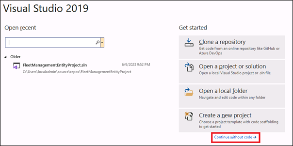
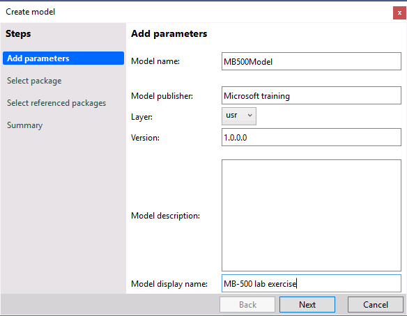

---
lab:
    title: 'Exercise 01: Lab: Create a composite data  entity'
    module: 'Learning Path 04: Connect to finance and operations apps'
---

# Change Record

<html>
<table><tr><th>Version</th><th>Date</th><th>Change</th></tr>
<tr><td>1.0</td><td>29 Sep 2023</td><td>Initial release</td></tr>
</table>
</html>

# Objective

If you need to export or import records from a table, you can create a data
entity and use the Data management framework to transfer the data. There are
business processes where you may require sending data from two different data
entities together, which have header-line relationships, like sales header and
sales line, purchase header and purchase line etc.

In this lab, we will create a composite data entity using two entities which
have header-line relationships like color group and color. After the creation of
the composite entity, we will use this entity to export data in the XML format.

# Exercise 1: Create model and project 

1.  Run Visual Studio 2019 from the desktop.

2.  Select **Continue without code** in the popped-up dialog **Visual Studio
    2019.**

**Note:** *You can check if there is already a model created named MB500Model. If not, please continue from step 13 to step 18. If the model is already present, execute step 3 to step 11.*

3.  Navigate to **Extensions** \> **Dynamics 365** \> **Model Management** \>
    **Update model parameters**.

4.  Select **Model name** *MB-500 lab exercise*.

5.  Select the **Next** button.

6.  In the **Select referenced packages** dialog, select the following packages:
<ul><li>ApplicationFoundation</li>
<li>ApplicationPlatform</li>
<li>ApplicationSuite</li>
<li>Retail</li></ul>

7. Select the **Next** button until the dialog is closed.

8.  Open **Solution Explorer**.

9.  Right click on the solution *SlnMb500Lab*.

10.  Select **Add \> New project**. The template will be Finance Operations

11.  Type *PrjMb500Lab-4* as the name of the new project.

12.  Resume with Exercise 2.

13.  Select **Extensions \> Dynamics 365 \> Model management \> Create model**
    and enter the following information to create a new model, then select
    **Next**:

- **Model name**: MB500Model
    
- **Model publisher**: Microsoft training
    
- **Layer**: usr
    
- **Version**: 1.0.0.0
    
- **Model display name**: MB-500 lab exercise

14.  Select **Create new package** followed by the **Next** button.

15.  Select the following referenced packages followed by the **Next** button:

- ApplicationFoundation

- ApplicationPlatform

- ApplicationSuite

- Retail

16. In the **Summary** step, check **Create new project** and select the
    **Next** button.

17. In the **Configure your new project** dialog, type *PrjMb500Lab-4* and
    *SlnMb500Lab* in the **Project name** and **Solution name** fields
    respectively, then select **Create**.

18. The new solution and project will appear in Solution **Explorer**.

# Exercise 2: Working with Data models

## Task 1: Create a new data entity from table RetailColorGroupTable

**Note:** *In this task, we will create a data entity for the Color group header table.*

1.  In the (View \> ) **Application Explorer**, select  the *RetailColorGroupTable*
    table under **Data Model**.

2.  Right click on the *RetailColorGroupTable* table and select **View Designer** to
    open in the **Element designer** pane.

3.  Right click on the root node of the *RetailColorGroupTable* table in the
    **Element designer** pane.

4.  Select **Addins** \> **Create data entity**.

5.  A **Microsoft Visual Studio** dialog will appear stating that the data
    entity, staging table and security artifacts are already created and added
    to the project, so go ahead and select the **OK** button.

	i.  A new folder **Data Entities** will be created in the **Solution Explorer**
    under the project *PrjMB500Lab-4*.

	ii.  In the **Data Entities** folder, a new element *RetailColorGroupTableEntity*
	    will also be created.
	
	iii.  A new folder **Tables** will be created in the **Solution Explorer** under
	    the project *PrjMB500Lab-4*.
	
   	iv.   In the **Tables** folder, a new element *RetailColorGroupTableStaging* will
	    also be created.
	
	v. A new folder **Security Privileges** will be created in the **Solution
	    Explorer** under the project *PrjMB500Lab-4*.
	
	vi. In the **Security Privileges** folder, two new elements
	    *RetailColorGroupTableEntityMaintain* and *RetailColorGroupTableEntityView*
	    will also be created.

## Task 2: Create a new data entity from table RetailColorGroupTrans

**Note:** *In this task, we will create a data entity for the Color group line table. Also, we add a relation with the data entity created for the Color group header table.*

1.  In the (View \> ) **Application Explorer**, select *RetailColorGroupTrans*
    table under **Data Model**.

2.  Right click on *RetailColorGroupTrans* table and select **View Designer** to
    open in in the **Element designer** pane.

3.  Right click on the root node of *RetailColorGroupTrans* table in the
    **Element designer** pane.

4.  Select **Addins** \> **Create data entity**.

5.  A **Microsoft Visual Studio** dialog will appear stating that the data
    entity, staging table and security artifacts are already created and added
    to the project, so select the **OK** button.

	i.  In the **Data Entities** folder, a new element *RetailColorGroupTransEntity*
	    will be created.
	
	ii.  In the **Tables** folder, a new element *RetailColorGroupTransStaging* will
	    be created.
	
	iii.  In the **Security Privileges** folder, two new elements will be created.
	    *RetailColorGroupTransEntityMaintain* and *RetailColorGroupTransEntityView*
    
9.  Right click on the **Relations** node of the data entity *RetailColorGroupTransEntity* and create a new
    relation.

10. Navigate to the Properties pane of the newly created relation and enter the
    following:

    1.  Related Data Entity: RetailColorGroupTableEntity

    2.  Name: RetailColorGroupTableEntity

    3.  Cardinality: ZeroMore

    4.  Related Data Entity Cardinality: ZeroOne

    5.  Relationship Type: Association

11. Right click on the Relation RetailColorGroupTableEntity and create a new
    Normal relation.

12. Navigate to the Properties pane of the newly created Normal relation and
    enter the following:

    1.  Field: colorGroup

    2.  Related Field: colorGroup

13. The relation will look like:

	RetailColorGroupTransEntity.colorGroup == RetailColorGroupTableEntity.colorGroup

## Task 3: Working with staging table RetailColorGroupTableStaging

**Note:** *In this task, we will create two columns in the staging table, which will be used to define runtime relationships during the target data movement.*

1.  In the **Solution Explorer,** locate table *RetailColorGroupTableStaging*
    under the **Tables** folder in the project *PrjMB500Lab-4.*

2.  Open the table *RetailColorGroupTableStaging* in the **Element designer**.

3.  Right click on the **Fields** node and add two integer fields named *RowId*
    and *ParentRowId*.

4.  No need to change the other default properties of the newly created fields.

## Task 4: Working with staging table RetailColorGroupTransStaging

**Note:** *In this task, we will create two columns in the staging table, which will be used to define runtime relationships during the target data movement. We will also create a relation with the Color group staging table.*

1.  In the **Solution Explorer,** locate table *RetailColorGroupTransStaging*
    under the **Tables** folder in the project *PrjMB500Lab-4.*

2.  Open the table *RetailColorGroupTransStaging* in the **Element designer**.

3.  Right click on the **Fields** node and add two integer fields named *RowId*
    and *ParentRowId*.

4.  No need to change the other default properties of the newly created fields.

5.  Right click the **Relations** node of the table
    *RetailColorGroupTransStaging* and create a new relation.

6.  Navigate to the Properties pane of the newly created relation and enter the
    following:

    1.  Related Table: RetailColorGroupTableStaging

    2.  Name: RetailColorGroupTableStaging

    3.  Cardinality: ZeroMore

    4.  Related Table Cardinality: ZeroOne

    5.  Relationship Type: Association

    6.  On Delete: Cascade

7.  Right click on the Relation RetailColorGroupTableStaging and create three
    new Normal relations.

    1.  Navigate to the Properties pane of the first Normal relation and enter
        the following:

        -   Field: colorGroup

        -   Related Field: colorGroup

    2.  Navigate to the Properties pane of the second Normal relation and enter
        the following:

        -   Field: DefinitionGroup

        -   Related Field: DefinitionGroup

    3.  Navigate to the Properties pane of the third Normal relation and enter
        the following:

        -   Field: ExecutionId

        -   Related Field: ExecutionId

8.  The relations will look like:

	RetailColorGroupTransStaging.colorGroup == RetailColorGroupTableStaging.colorGroup
	RetailColorGroupTransStaging.DefinitionGroup == RetailColorGroupTableStaging.DefinitionGroup
	RetailColorGroupTransStaging.ExecutionId == RetailColorGroupTableStaging. ExecutionId

## Task 5: Create a new Composite Entity – MBColorGroupCompositeEntity

**Note**: *In this task, we will create the composite entity, that will combine both the above created entities in a single element.*

1.  In the **Solution Explorer** right click on the project *PrjMB500Lab-4.*

2.  Select **Add** \> **New Item.**

3.  Under **Dynamics 365 Items**, select **Data Model** and select **Composite
    Data Entity**.

4.  In the **Name** field type *MBColorGroupCompositeEntity* and select the
    **Add** button.

5.  A new folder **AxCompositeDataEntityView** will be created in the **Solution
    Explorer** under the project *PrjMB500Lab-4*.

6.  In the **AxCompositeDataEntityView** folder, a new element
    *MBColorGroupCompositeEntity* will also be created.

7.  Open the *MBColorGroupCompositeEntity* composite data entity in the
    **Element designer** pane.

8.  Navigate to the **Properties** pane of the *MBColorGroupCompositeEntity*
    composite data entity and change the **Label** to *Color Group Composite
    Entity*.

9.  Right click on the root node and select **New Root Data Entity Reference**.

10. Select the newly created node *DataEntityViewReferenceRoot1* and navigate to
    the **Properties** pane.

11. Change both the properties **Data Entity** and **Name** to
    *RetailColorGroupTableEntity*.

12. Right click on the node *RetailColorGroupTableEntity* and select **New
    Embedded Data Entity Reference**.

13. Select the newly created node *DataEntityViewReferenceEmbedded1* and
    navigate to the **Properties** pane.

14. Enter the properties as follows:

    1.  **Data Entity:** *RetailColorGroupTransEntity*

    2.  **Name:** *RetailColorGroupTransEntity*

    3.  **Relation:** *RetailColorGroupTableEntity*

# Testing

1.  In the **Solution Explorer** right click on the project *PrjMB500Lab-4.*

2.  Select **Build.**

3.  Once the build is successful, navigate to the finance and operations apps
    page on your browser and refresh the page.

4.  Select legal entity **USMF**.

5.  Navigate to **Workspaces \> Data Management**.

6.  Select the tile **Framework parameters**.

7.  Select the **Refresh entity list** button under the tab page **Entity
    settings**.

8.  Navigate back to the **Data Management** workspace and select the **Data
    entities** tile.

9.  Check the **Entity** column if the *Color Group Composite Entity* is updated
    in the list of entities.

10. Once updated, navigate back to the **Data Management** workspace, and select
    the **Export** tile.

11. In the **Group name** field, enter *Color group export*.

12. Select the **Add entity** button under the **Selected entities** fastTab.

13. In the **Entity name** field, select *Color Group Composite Entity*, the
    newly created composite entity.

14. In the **Target data format** field, select *XML-Element* and select the
    **Add** button.

15. *Once it's added,* close the **Add entity** dialog by selecting the **Close** button.

16. In the action pane, select the **Save** button.

17. Select the **Export now** button, under **Export options** in the action
    pane.

18. The **Execution summary** page will appear with a “Checked” image in the
    **Execution summary::Export** fastTab.

19. Select the **Download file** button under the Entity processing status fastTab.

20. Download the *Color group export-Color Group Composite Entity.xml* file and
    open it.

21. You will find that the records from the tables *RetailColorGroupTable* and
    *RetailColorGroupTrans* will appear in the XML file.
