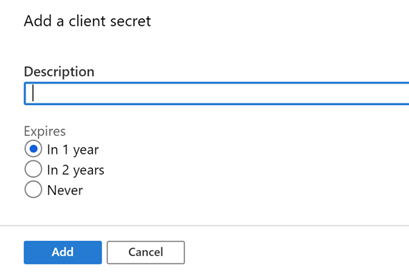
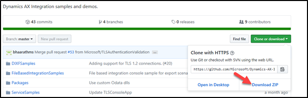
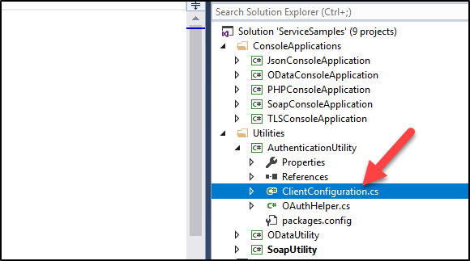
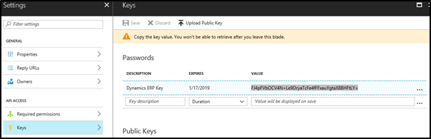
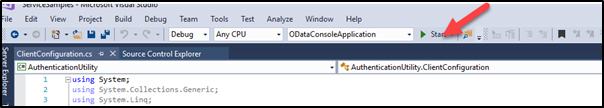
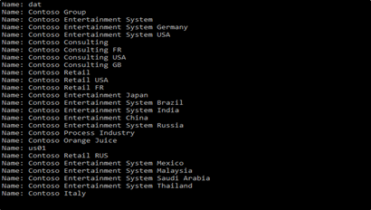

---
lab:
    title: 'Exercise 01: OData integration'
    module: 'Module 08: Integration'
---

**MB-500: Microsoft Dynamics 365: Finance and Operations Apps Developer**

**Lab 8a - OData Integration**

Change Record
=============

| Version | Date        | Change                                                           |
|---------|-------------|------------------------------------------------------------------|
| 1.0     | 10 Jan 2020 | Initial release                                                  |
| 1.01    | 22 Jan 2021 | Remove table of contents; update branding; remove LCS references |
| 1.02    | 29 Jan 2021 | Restored images |

Lab Environment
===============

In order to run this lab, you will need:

-   An all-in-one demo data VM with

    -   Visual Studio installed, and a Visual Studio subscription

    -   A browser to run the user interface

    -   Lab 1 – Development Environment Configuration completed

-   Access to the Azure portal at <https://portal.azure.com>    

-   Dynamics AX Integration samples and demos, which may reside on your VM or
    can be downloaded from
    <https://github.com/Microsoft/Dynamics-AX-Integration> as
    Dynamics-AX-Integration-master.zip

Lab Overview
============

-   Dependency: Lab 1 – Development Environment Configuration should be
    completed

-   Integration with Dynamics 365 Finance and Operations apps using OData
    endpoints

**Estimated time to complete this lab: 40+ minutes**

Scenario
========

In this lab, you need to write a program in .net that will directly consume an
OData endpoint exposed from a Dynamics 365 Finance and Operations instance.

Exercise 1: Register with Azure AD
==================================

Task 1: Register Application and Create Application Key
-------------------------------------------------------

1.  Navigate to <https://portal.azure.com>    

2.  Select **Azure Active Directory** in the left panel and select **App Registrations** 
in the middle panel. Then select **New Registration** button
    in the top of the right pane 

3. Select **New registration** and enter a name for your application such
   as DDTD365FO\<your name\>. Save this name.

4. Select **Accounts in any organizational directory (Any Azure AD directory
   – Multitenant)** as Supported account type

5. In the Redirect URI select Application Type of **Web**

6. Enter [http://localhost](http://localhost/) in the application redirect
   URL, this won’t be used for this type of sign in, however the field is still
   required

7. After verifying your input please select the **Register** button

8. Open your application and select **API Permissions** under Manage

9. Select **Add a permission**. Under **Select an API**, in the Microsoft APIs
tab, select **Dynamics ERP** (you can use Ctrl-F to find)

10.  Select each type of permission, Delegated permissions and Application
    permissions, and select all for each.

11.  Select **Add permissions**.

12.  Next we add the key. In the Manage panel, select **Certificates & secrets**.

13.  Select **+ New client secret** and add a description or leave it blank

14.  Select the duration and select **Add**.

15.  Copy the **Key Value** and save it.  You will need this key in future labs. 
    Should you lose it, you can always come back here and create a new one. 

16.  Go back to the App registrations screen and save the **Application (client)
    ID** for Task 2.

Task 2: Setup AAD Parameter in Dynamics 365 for Finance and Operation
---------------------------------------------------------------------

1.  In the UI (open a new tab, leaving the last one open), navigate to
    **Modules** \> **System Administration \> Setup \> Azure Active Directory
    Applications**

2.  In the Client Id, put the Application ID of the registered app in Azure AD

3.  Specify Name – Recurring Data Integration

4.  Specify User id – your user credential (often Admin)

5.  Save

Exercise 2: Access Dynamics 365 with OData 
===========================================

Task 1: Download the utility helper classes
-------------------------------------------

1.  Navigate to and <https://github.com/Microsoft/Dynamics-AX-Integration> and
    select **Clone or download**. This resource may instead be already provided
    to you on your virtual machine. If not provided on the VM, you may also find
    it at <http://aka.ms/mb500labresources>

2.  Save the zip file on your computer and **extract all**.

3.  Open Visual Studio (Always open Visual Studio as administrator. You can set
    this on **Properties \> Advanced** of the shortcut.)

4.  Open (**File \> Open \> Project/Solution**) the unzipped folder and open the
    **ServiceSamples** solution

5.  **Build** the solution and make sure it builds successfully

6.  Go to the **Utilities \> Authentication Utility** and open the
    ClientConfiguration.cs file

7.  Replace the UriString value with your Dynamics 365 Finance and Operations
    apps URL and remove the Username and Password

8.  Replace the ActiveDirectoryResource and ActiveDirectoryTenant with your
    Dynamics 365 Finance and Operations apps URL and your active directory
    tenant.

9.  Go to Azure portal and open the app registration you created, and copy the
    Application ID. You can do this by selecting the **Copy** icon to the right
    of the ID.

10. Go back to Visual Studio and replace the ActiveDirectoryClientAppId with the
    one you copied

11. Provide the secret Key you saved earlier. You can create a new key if you
    can’t locate the one you created

12. Set ODataConsoleApplication as Startup Project

13. Select **Start**

14. If you get the message “The application is in break mode”, stop debugging
    and select **Start** again

Check Output:
=============

The app should run successfully with several lines of output

