**MB-500: Microsoft Dynamics 365: Finance and Operations Apps Developer**

**Lab 8b - Logic App Integration**

Lab Environment
===============

In order to run this lab, you will need:

-   An all-in-one demo data VM with

    -   Visual Studio installed, and a Visual Studio subscription

    -   Lab 1 – Development Environment Configuration completed

-   An email account

-   Access to the Azure portal at <https://portal.azure.com> and an Azure
    account, with an Azure pass which is provided to learners

Lab Overview
============

-   Dependency: Lab 1 – Development Environment Configuration should be
    completed

-   Using Azure resources to create Service Bus and Logic App

-   Integration with Dynamics 365 for Finance and Operations using Logic App

**Estimated time to complete this lab: 40+ minutes**

Scenario
========

-   You need to create a Service Bus in the Azure portal using the Azure pass
    provided to you

-   You need to develop .NET code that will pass a JSON message to the Service
    Bus. The message will contain customer information like code, name, group
    etc.

-   The JSON message will be parsed and consumed by Dynamics 365 Unified
    Operations connector in Logic Apps

-   A new customer record will be created in Dynamics 365 Finance and Operations

-   Mail will go to specified recipient from the mail id configured in Logic App

Exercise 1: Sign up for an Azure Subscription
=============================================

In this exercise, you will sign up for an Azure subscription to use during the
course. Your instructor will inform you if there are pass codes available – if
not please use the standard trial process.

Task 1: Sign up for Azure with a Pass Code
------------------------------------------

1.  *If you have an Azure Pass code* from your instructor, log in to your
    Dynamics 365 trial organization and then navigate to
    [www.microsoftazurepass.com](http://www.microsoftazurepass.com)

2.  Login with your LCS credentials and select **Confirm Microsoft Account**

    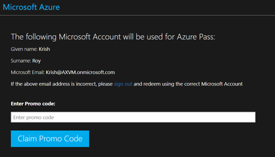

3.  Enter the Promo code supplied to you

Exercise 2: Creation of Customer data using Logic App
=====================================================

Task 1: Create a new Service Bus
--------------------------------

1.  Go to your Azure Portal, select **New**, select **Service Bus** and press
    Enter. If you have the new portal, under Azure services, select **More
    services**, and do a find for **Service bus**, which you will select.

    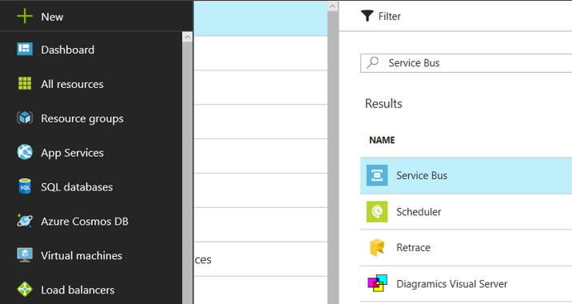

2.  Select **Service Bus**, select Add if needed, enter service bus name
    ‘**SBXXXX**’, select Basic pricing tier, select **new/existing resource
    group** and create new Service Bus

3.  Create a new **Queue**, named “Customer”. These options will vary widely
    depending on the Azure Portal; do not worry if they are different.

Task 2: Create a C\# class to populate message in Service Bus
-------------------------------------------------------------

1.  Open Visual Studio

2.  Add a new Visual C\# project of type Console Application and name it
    PopulateCustomer

3.  Under your project right select **References** node and select **Manage
    NuGet Packages**

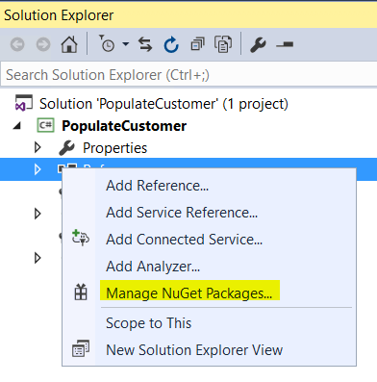

4.Select **Browse** and add these two NuGet Packages in your reference:
    Newtonsoft.Json and select version v11.0.1 and WindowsAzure.ServiceBus
    v4.1.7. It’s important to use these versions.

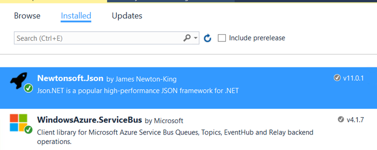

5.To create a Data Contract for the Customer Entity, add a new C\# class
    JsonBody.cs

6.Add the following code in the class

<pre><code>using System;
using System.Collections.Generic;
using System.Linq;
using System.Text;
using System.Threading.Tasks;
using System.Runtime.Serialization;
using Newtonsoft.Json;

namespace PopulateCustomer
{
    [DataContract]
    public class JsonBody
    {
        [DataMember]
        public string AddressCountryRegionId { get; set; }
        [DataMember]
        public string CustomerAccount { get; set; }
        [DataMember]
        public string CustomerGroupId { get; set; }
        [DataMember]
        public string Name { get; set; }
        [DataMember]
        public string SalesCurrencyCode { get; set; }
        [DataMember]
        public string dataAreaId { get; set; }
    }
}

</code></pre>

7.Add or locate a C\# class named Program that will create the json
    message and send the message to the service bus

8.Add the following code in the new runnable class. The connection string will
    be derived shortly.

<pre><code>using System;
using System.Collections.Generic;
using System.Linq;
using System.Text;
using System.Threading.Tasks;
using Microsoft.ServiceBus.Messaging;
using Newtonsoft.Json;
using System.Runtime.Serialization.Json;
using System.IO;

namespace PopulateCustomer
{
    class Program
    {
        static void Main(string[] args)
        {
            PopulateCustomer.JsonBody customer = new JsonBody();
            customer.CustomerAccount = "Testxxxx";
            customer.CustomerGroupId = "10";
            customer.AddressCountryRegionId = "USA";
            customer.SalesCurrencyCode = "USD";
            customer.dataAreaId = "USMF";
            customer.Name = "Test xxxx";
            string output = JsonConvert.SerializeObject(customer);
            var connectionString = <Add the connection string of your Service Bus>;
            var queueName = "customer";
            var client = QueueClient.CreateFromConnectionString(connectionString, queueName);
            var payloadStream = new MemoryStream(Encoding.UTF8.GetBytes(output));
            var message = new BrokeredMessage(payloadStream, true);
            client.Send(message);
        }
    }
}
</code></pre>

9.In the Azure portal, select **Service Bus \> Settings \> Shared access
    policies**

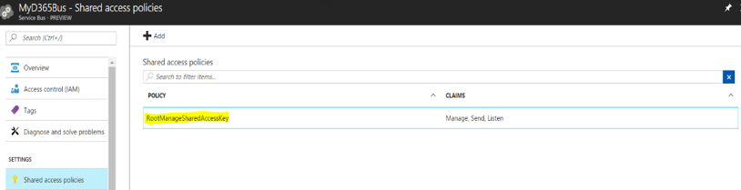 

10.Under Policy, select **RootManageSharedAccessKey**. You will find the
    Primary Connection String. Copy it and paste it in the code within quotes

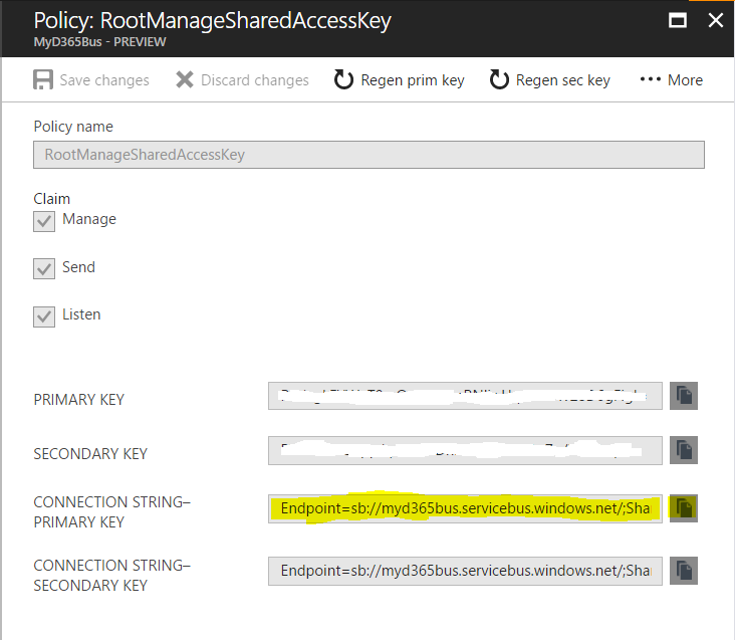

11.Enter the Queue name in the code

12.**Save** and **Build** the C\# code

Task 3: Create a Logic App
--------------------------

1.  Log in to Azure Portal and create a new Logic App:

    1.  \+ Create a resource

    2.  Search for, and select, Logic App

    3.  Select Create

    4.  Enter a name and use your existing resource group; Create

    5.  When deployment is successful, open the Logic App from your alert

2.  Start with a common trigger. Select “**When a message is received in a
    Service Bus queue**”

    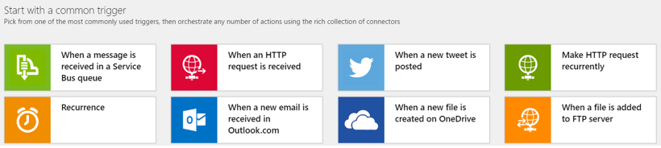

3.  By default, your Service bus trigger should associate the service bus you
    have created in the same resource group.

    1.  If you have a + sign, click the + sign. Click Service Bus and manually
        enter connection information. Open another tab & find your service bus.
        Go to Shared access policiies, click on your policy, and copy the
        Primary Connection String

    2.  If you have a Continue button, select that.

4.  Add the connection string and queue name below. For queue name, type or
    select **customer**.

    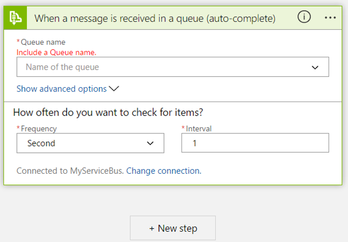

    Note:
<ul>
<li>If you want to change the Service Bus, select **Change Connection**</li>
<li>If you want to change the frequency of data reading from service bus, select
    **Edit – we recommend every 1 minute**</li>
</ul>

5.Select **+ New step** button below and select **Add an Action** if available

6.In the search panel select **Parse Json** and select **Data Operations –
    Parse JSON** action

   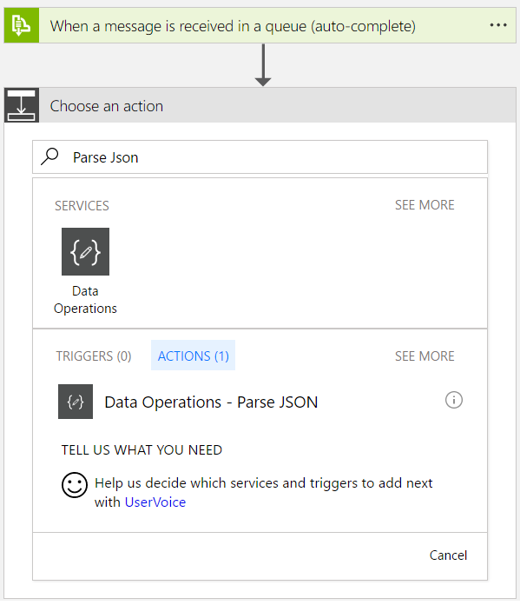

7.Position the cursor in the Content box, and select Content from the right panel

   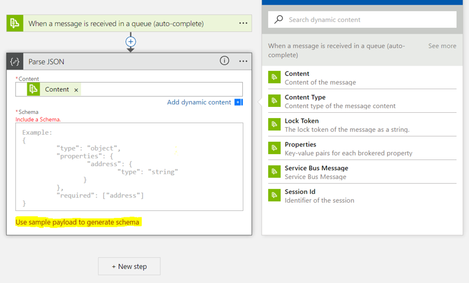

8.Select the link which says **Use sample payload to generate schema**. You
   will get the option to load a json message (as shown below); which will form
   the json schema and get pasted in the Schema field of the previous diagram,
   then select **Done**

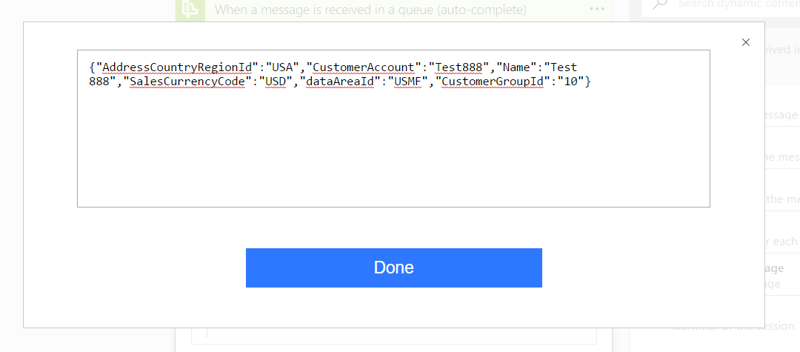

<pre><code>{"AddressCountryRegionId":"USA", "CustomerAccount":"Test888", "Name":"Test 888", "SalesCurrencyCode":"USD", "dataAreaId":"USMF", "CustomerGroupId":"10"}
</code></pre>

   The schema should look like this:

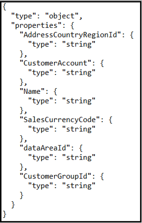

9.Select **+ New step** button below and select **Add an Action** if available

10.Select **Dynamics 365 Operations Create record** or the button may be
    **Dynamics 365 for Fin & Ops Create record**, depending on your version.
   Make sure it is Operations or Ops. You do not want just “Dynamics 365”

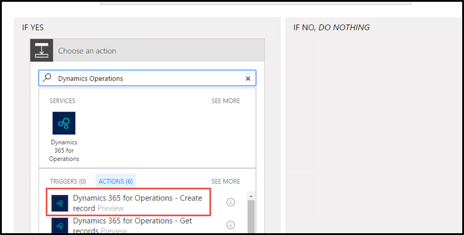

11.Populate Create Record Action as:

    1.  Instance: Select your instance from the drop down

    2.  Entity name: Select Customers (wait for the next fields to display)

    3.  Customer account: Position the cursor in the field, then the available
        fields will display on the right. Select CustomerAccount.

    4.  Name: Position the cursor in the field, then select Name.

    5.  Currency: SalesCurrencyCode.

    6.  Customer group: CustomerGroupId.

    7.  Company: dataAreaId

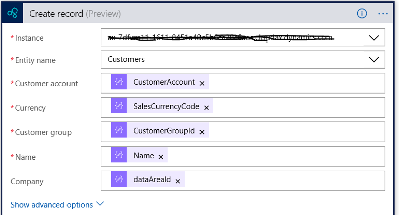

12.Optional: Select **New Step,** and select **Add an Action** if available

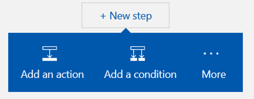

13.Optional: You can select [Office365 Outlook/Gmail] and select **send email**

   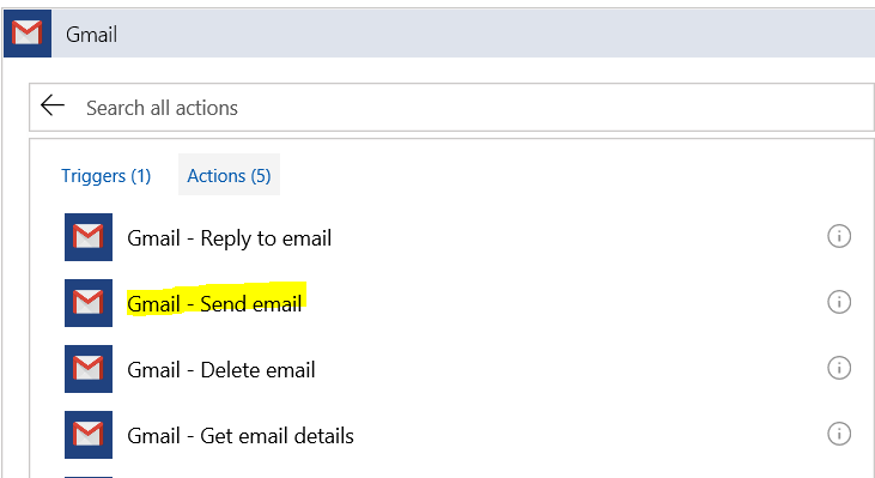

14.Optional: Specify To address, subject, body etc.

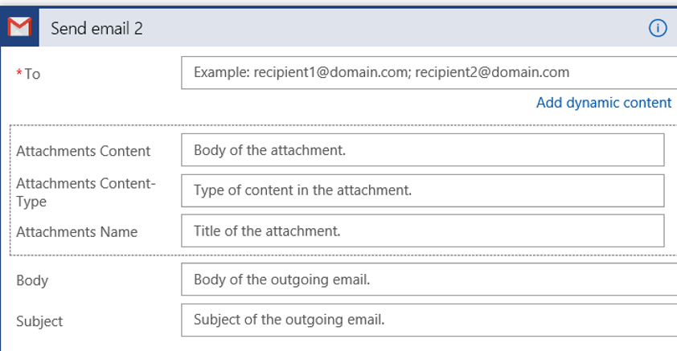

15.Select **Code View** button

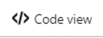

16.Find the following code

    "content": "\@triggerBody()?['ContentData']"

17.Replace that line with this:

    "content": "\@json(decodeBase64(triggerBody()?['ContentData']))"

18.**Save** the Logic App. Run the VS class and when complete, run the Logic
    App.

Check Output
------------

-   A new record will be created in the Customer form in Dynamics 365 Finance
    and Operations – you can check this on the All Customers screen

-   Optional: Mail will be sent to the specified recipient regarding the newly
    added customer
