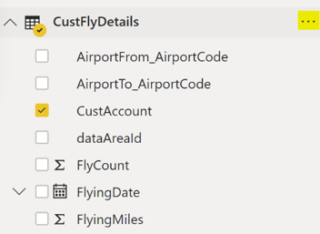
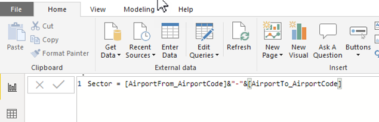
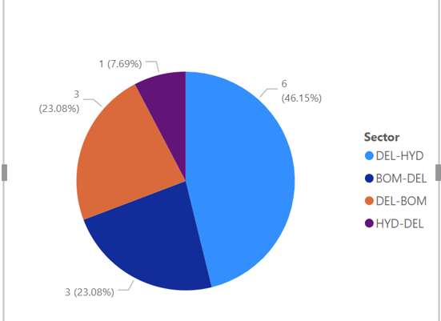

**MB-500: Microsoft Dynamics 365: Finance and Operations Apps Developer**

**Lab 9 - Power BI Reporting**

Lab Environment
===============

In order to run this lab, you will need:

-   An all-in-one demo data VM with

    -   A browser to run the user interface

    -   Lab 5 – Code Extension & Development completed

-   Power BI Desktop, which is downloadable at
    <https://www.microsoft.com/en-us/download/details.aspx?id=58494> as
    PBIDesktopSsetup_x64.exe

-   Note that in order to run Task 2, you will need to be admin in your tenant.
    If you are not, you can still create a PowerBI in Task 1, but cannot bring
    it back to Dynamics in Task 2. One way around this is to log into
    PowerBI.com using a Live ID, and sign up for a trial.

Lab Overview
============

-   Dependency: Lab 5 – Code Extension & Development should be completed

-   Develop Power BI report in PB Desktop using an Entity from Dynamics 365 for
    Finance and Operations

-   Publish the report in the Power BI dashboard

-   Publish the report in the Dynamics 365 for Finance and Operations workspace

**Estimated time to complete this lab: 45+ minutes**

Scenario
========

We need to create a report in Power BI that will show a pie chart. The pie chart
will contain Sector with flight count. This report should be shown in the Power
BI dashboard as well as the Dynamics 365 Finance and Operations workspace.

Exercise: Power BI reporting
============================

Task 1: Power BI Desktop
------------------------

1.  Download Power BI Desktop at
    <https://www.microsoft.com/en-us/download/details.aspx?id=58494>

2.  Install Power BI Desktop and open the application

3.  In the top right corner, there is an option to sign in. If you are not
    already signed in, select it and sign in using your LCS credentials or
    Microsoft Account

4.  Select **Get Data \> OData Feed** (found under Other) and **Connect**

5.  Enter your Dynamics 365 for Finance and Operations url with a suffix ‘/data’

    1.  Ex: https://\<yourVM\>devaos.cloudax.dynamics.com/data

6.  If asked for a login: select **Organizational account** and Sign in, then
    **Connect**

7.  Select CustFlyDetails from the list of Data Entities in the Navigator window
    by checking the box and **Load**

8.  In the right pane of the Power BI desktop, you will find the CustFlyDetails
    entity and all the columns in that entity

9.  Click the **…** option to create a **new column** in the entity

    

10. Name the new column “Sector” with the formula as follows

	[AirportFrom_AirportCode]&"-"&[AirportTo_AirportCode]

   Therefore, the formula on the left will look like:

	Sector = [AirportFrom_AirportCode]&"-"&[AirportTo_AirportCode]

11.From the list of Visualizations, select “Pie Chart”

12.Assign the new column “Sector” in Details (hint: drag and drop)

13.Assign “Count of CustAccount” in Values (hint: drag and drop CustAccount and
    it will automatically populate Count of)

14.The pie chart should look similar to this:

15.**Save** the visual as a pbix file

16.Select the **Publish** button at the top right end

17.Open <https://powerbi.microsoft.com/> and sign in

18.Under **My Workspace \> Reports**, you should find your new visuals

19.Add that in a new dashboard by clicking on the pin (third button from top
    right of the visuals)

Task 2: Power BI on Dynamics 365 for Finance and Operations
-----------------------------------------------------------

1.  Open <https://dev.powerbi.com/apps> to register the application

    1.  Log in

    2.  Type “**Dynamics 365 for Finance and Operations**” as Application Name

    3.  Select “**Server-side web Application**” in the Application Type field

    4.  Type <https://app.powerbi.com/> in the Homepage URL field

    5.  Type Dynamics 365 Finance and Operations URL suffixed by “**/oauth**” in
        the Redirect URL field

    6.  Check “**Select All**” under the API Access option and select
        **Register**

    7.  Application ID and Application Secret field will be populated with some
        random numbers; store them in a notepad file

2.  Go to your user interface’s **Modules \> System
    administration \> Setup \> PowerBI.com configuration** to open the Power BI
    configuration page; select **Edit**

    1.  Enabled: Set the option to Yes.

    2.  Application ID: Enter the Application ID value that you recorded
        earlier.

    3.  Application key: Enter the Secret Key value that you recorded earlier.

    4.  Click Save to save your changes

3.  Open the **Reservation Management** Workspace

4.  In the Power BI banner, click **Get started**. If this is the first time
    that you’ve started Power BI from Dynamics 365 for Finance and Operations,
    you’re prompted to authorize sign-in to Power BI from the D365 client.
    Click **Click here** to provide authorization to Power BI.

5.  Because you’re already signed in to AAD in Dynamics 365 for Finance and
    Operations, you don’t have to enter your credentials again. A new tab
    appears, where you’re prompted to authorize the connection between Dynamics
    365 for Finance and Operations and Power BI. You can now return to the
    original tab.

6.  The Add / remove Power BI tiles slider dialog opens. The tabs on the left
    show your dashboards, and the related visualizations appear on the right.
    You can now select visualizations to add (pin) to the workspace.

7.  After you’ve finished selecting visualizations, click **OK**

8.  The Power BI visual should be published in your new workspace

Check Output
============

Open <https://powerbi.microsoft.com>. The pie chart should be available under
the Dashboard menu.

Open Reservation Management workspace in Dynamics 365 Finance and Operations.
The Pie chart should be available in the workspace under the PowerBI tab.
