**MB-500: Microsoft Dynamics 365: Finance and Operations Apps Developer**

**Lab xx: Business Events**

Lab Environment
===============

In order to run this lab, you will need:

-   An all-in-one demo data VM with

    -   Visual Studio installed, and a Visual Studio subscription

    -   A browser to run the user interface

    -   Lab 5 – Code Extension & Development completed

-   A Microsoft account (MSA) to run Microsoft Flow and which has access to the
    environment

-   This lab is optional – it can be tricky to add the MSA to the environment if
    not already there

Lab Overview
============

-   Dependency: Lab 5 – Code Extension & Development should be completed

-   Create a custom Business Event and add a Flow as Endpoint for that Business
    Event

**Estimated time to complete this lab: 45+ minutes**

Scenario 
=========

-   In this exercise you will create a custom Business Event that will send an
    Email message to the customer, whenever you add new flying details for that
    customer

-   The Email Id should be picked from the Customer data

-   The Email subject and body should include the Fly details and date

-   You will add Microsoft Flow as the endpoint to develop this exercise

Exercise 1: Develop Custom Business Event
=========================================

Task 1: Add a method in table CustTable
---------------------------------------

1.  Open MyLabAirlines in Solution Explorer

2.  Right click project and select **Add \> New Item**

3.  Select Class under **Dynamics 365 Items \> Code**

4.  Create a new class MLACustTableTable_Extension with the following signature

<pre><code>[ExtensionOf(tableStr(CustTable))]
final class MLACustTableTable_Extension
{
}
</code></pre>

5.Add the following code to fetch the email address of the customer

<pre><code>public Email getEmail()
    {
        DirPartyLocation dirPartyLocation;
        LogisticsElectronicAddress logisticsElectronicAddress; 
        LogisticsElectronicAddressRole logisticsElectronicAddressRole; 
        LogisticsLocationRole logisticsLocationRole;
        Email   emailValue;

        while select DirPartyLocation
            where dirPartyLocation.party == this.Party
        {
            while select logisticsElectronicAddress
                where logisticsElectronicAddress.Location == dirPartyLocation.Location
                    && logisticsElectronicAddress.Type == LogisticsElectronicAddressMethodType::Email
            {
                while select logisticsElectronicAddressRole
                    where logisticsElectronicAddressRole.ElectronicAddress == logisticsElectronicAddress.RecId
                    join logisticsLocationRole
                    where logisticsLocationRole.RecId == logisticsElectronicAddressRole.LocationRole
                {
                    if(!emailValue)
                    {
                        emailValue = logisticsElectronicAddress.Locator;
                    }
                }
            }
        }
        return emailValue;
    }
</code></pre>

Task 2: Add a Contract class for the Business Event
---------------------------------------------------

1.  Open MyLabAirlines in Solution Explorer

2.  Right click project and select **Add \> New Item**

3.  Select Class under **Dynamics 365 Items \> Code**

4.  Create a new class MLAFlightDetailsPostedBusinessEventContract with the
    following signature

<pre><code>[DataContract]
public final class MLAFlightDetailsPostedBusinessEventContract extends BusinessEventsContract
{
}
</code></pre>

5.Create all the Member variables of the above class as follows

<pre><code>private CustAccount     custAccount;
    private Email           custEmail;
    private String10        flyingDate;
    private DDTAirportCode  flyingFrom;
    private DDTAirportCode  flyingTo;
    private DDTFlyingMiles  flyingMiles;
    private LegalEntityDataAreaId legalEntity;
</code></pre>

6.Initialize all the member variables

<pre><code>private void initialize(DDTCustFlyDetails _custFlyDetails)
    {
        custAccount = _custFlyDetails.CustAccount;
        custEmail   = CustTable::find(_custFlyDetails.CustAccount).email(); //earlier versions called it getEmail
        flyingDate  = date2Str(_custFlyDetails.FlyingDate,213,DateDay::Digits2, DateSeparator::Slash, DateMonth::Digits2, DateSeparator::Slash, DateYear::Digits4);
        flyingFrom  = DDTAirport::getAirportCode(_custFlyDetails.FlyFrom);
        flyingTo    = DDTAirport::getAirportCode(_custFlyDetails.FlyTo);
        flyingMiles = _custFlyDetails.FlyingMiles;
    }
</code></pre>

7.Create a parm method for all the above variables

<pre><code>[DataMember('CustAccount'), BusinessEventsDataMember("Customer Account")]
public CustAccount parmCustAccount(CustAccount _custAccount = custAccount)
    {
        custAccount = _custAccount;

        return custAccount;
    }
</code></pre>

<pre><code>[DataMember('CustEmail'), BusinessEventsDataMember("Customer Email")]
public Email parmCustEmail(Email _custEmail = custEmail)
    {
        custEmail = _custEmail;

        return custEmail;
    }
</code></pre>

<pre><code>[DataMember('FlyingDate'), BusinessEventsDataMember("Date of Flying")]
public String10 parmFlyingDate(String10 _flyingDate = flyingDate)
    {
        flyingDate = _flyingDate;

        return flyingDate;
    }
</code></pre>

<pre><code>[DataMember('FlyingFrom'), BusinessEventsDataMember("Flying From Airport")]
public DDTAirportCode parmFlyingFrom(DDTAirportCode _flyingFrom = flyingFrom)
    {
        flyingFrom = _flyingFrom;

        return flyingFrom;
    }
</code></pre>

<pre><code>[DataMember('FlyingTo'), BusinessEventsDataMember("Flying To Airport")]
public DDTAirportCode parmFlyingTo(DDTAirportCode _flyingTo = flyingTo)
    {
        flyingTo = _flyingTo;

        return flyingTo;
    }
</code></pre>

<pre><code>[DataMember('FlyingMiles'), BusinessEventsDataMember("Flying Miles")]
public DDTFlyingMiles parmFlyingMiles(DDTFlyingMiles _flyingMiles = flyingMiles)
    {
        flyingMiles = _flyingMiles;

        return flyingMiles;
    }
</code></pre>

<pre><code>[DataMember('LegalEntity'), BusinessEventsDataMember("Legal Entity")]
public LegalEntityDataAreaId parmLegalEntity(LegalEntityDataAreaId _legalEntity = legalEntity)
    {
        legalEntity = _legalEntity;

        return legalEntity;
    }
</code></pre>

8.Create a method to call the initialize and return the Data Contract

<pre><code>public static MLAFlightDetailsPostedBusinessEventContract newFlightDetails(DDTCustFlyDetails _custFlyDetails)
    {
        var contract = new MLAFlightDetailsPostedBusinessEventContract();
        contract.initialize(_custFlyDetails);

        return contract;
    }
</code></pre>

9.Finally create a blank new() method

<pre><code>private void new()
{
}
</code></pre>

Task 3: Add the Business Event class
------------------------------------

1.  Open MyLabAirlines in Solution Explorer

2.  Right click project and select **Add \> New Item**

3.  Select Class under **Dynamics 365 Items \> Code**

4.  Create a new class MLAFlightDetailsPostedBusinessEvent with the following
    signature [no space before summary]

<pre><code>/// < summary>
/// Fly details posted business event.
/// < summary>
[BusinessEvents(classStr(MLAFlightDetailsPostedBusinessEventContract), 'Customer Fly Details', 'Customer Flight Description', ModuleAxapta::SalesOrder)]
public final class MLAFlightDetailsPostedBusinessEvent extends BusinessEventsBase
{
}
</code></pre>

5.Add the following Member variable in the class

<pre><code>private DDTCustFlyDetails custFlyDetails;
</code></pre>

6.Add the following methods in the class

<pre><code>private DDTCustFlyDetails parmCustFlyDetails(DDTCustFlyDetails _custFlyDetails = custFlyDetails)
    {
        custFlyDetails = _custFlyDetails;

        return custFlyDetails;
    }

</code></pre> <pre><code>/// < summary>
/// Creates a <c>FlyDetailsPostedBusinessEvent</c> from a <c>DDTCustFlyDetails</c> record.
/// < /summary>
/// < param name = "_custFlyDetails"> A <c>DDTCustFlyDetails</c> record.< /param>
/// < returns>A <c>MLAFlightDetailsPostedBusinessEvent</c>.< /returns>
public static MLAFlightDetailsPostedBusinessEvent newFromCustFlyDetails(DDTCustFlyDetails _custFlyDetails)
{
    MLAFlightDetailsPostedBusinessEvent businessEvent = new MLAFlightDetailsPostedBusinessEvent();
    businessEvent.parmCustFlyDetails(_custFlyDetails);

    return businessEvent;
}
</code></pre> <pre><code>private void new()
{
}
</code></pre> <pre><code>[Wrappable(true), Replaceable(true)]
public BusinessEventsContract buildContract()
{
   return MLAFlightDetailsPostedBusinessEventContract::newFlightDetails(custFlyDetails);
}
</code></pre> 

Task 4: Sending the Business Event 
-----------------------------------

The next step is to send the business event, whenever new record will be
inserted in the DDTCustFlyDetails table.

1.  Open MyLabAirlines in Solution Explorer

2.  Right click project and select **Add \> New Item**

3.  Select Class under **Dynamics 365 Items \> Code**

4.  Create a new class MLACustFlyDetailsTable_Extension with the following
    signature

<pre><code>[ExtensionOf(tableStr(DDTCustFlyDetails))]
final class MLACustFlyDetailsTable_Extension
{
}
</code></pre>

5.Create a Chain of Command for the insert method as follows

<pre><code>public void insert()
{
    next insert();
    if (BusinessEventsConfigurationReader::isBusinessEventEnabled(classStr(MLAFlightDetailsPostedBusinessEvent)))
    {
            MLAFlightDetailsPostedBusinessEvent::newFromCustFlyDetails(this).send();
    }
}
</code></pre>

Task 5: Refresh list of Business Events
---------------------------------------

1.  In your Dynamics 365 for Finance & Operations instance, open **Modules \>
    System Administration \> Setup \> Business events \> Business events
    catalog**

2.  Select **Rebuild business event catalog** under **Manage** in the Action
    pane

    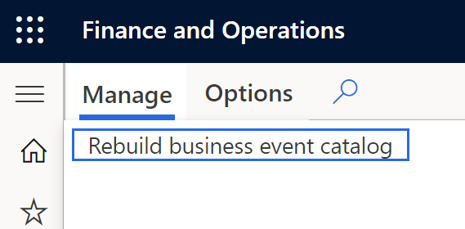

3.  You may get warnings about other templates. Ignore. When it completes, you
    should be able to see the custom Business event ID
    *MLAFlightDetailsPostedBusinessEvent* in the list

    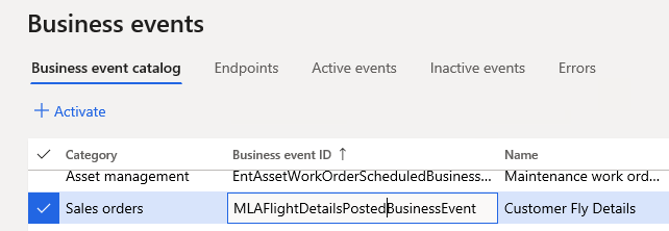

4.  Once you select Business Event *MLAFlightDetailsPostedBusinessEvent,* you
    will find the option to download the [Json] schema. Please download the
    schema. The name of the file will be
    *BusinessEventSchema_MLAFlightDetailsPostedBusinessEvent.txt*

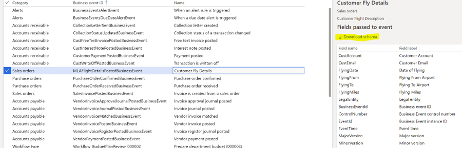

Exercise 2: Develop Custom Business Event
=========================================

Task 1: Launch Microsoft Flow
-----------------------------

1.  Open a new browser and type <https://flow.microsoft.com>

2.  Login to Microsoft Flow using your Microsoft Account (MSA)

3.  Select **Create**; followed by **Automated flow**

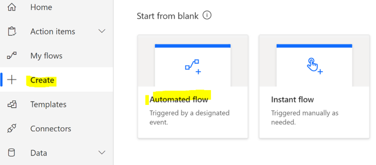

4.Type a name for the Flow and search for Dynamics 365 for Fin & Ops for the
    trigger. Select the trigger “**When a Business Event occurs**” and Create

![Choose your flow's trigger: When a business event occurs [Dynamics 365 for Fin & Ops]](Images/LabxxEx2Task1Step4.png)

5.Select the environment you are working with. Type the first few characters
    into instance and let the drop down suggest. The MSA needs access to the
    environment.

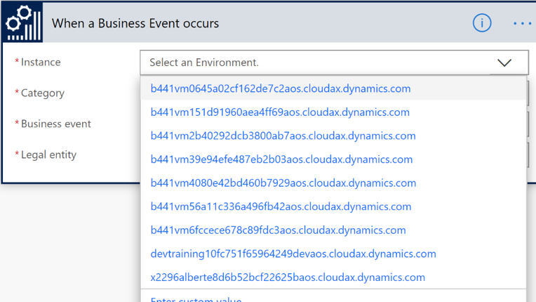

6.Select *Sales orders* as Category; followed by *Customer Fly Details* as the
    Business Event

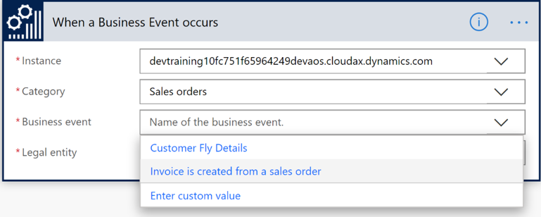

7.Finally select *USMF* as Legal Entity and select New Step

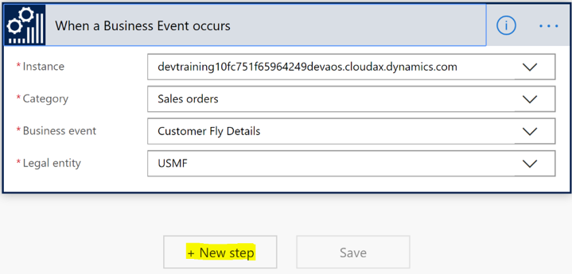

8.In the Choose an action box, type “**Parse Json**” and select *Data
    Operations – Parse JSON* as the next connector

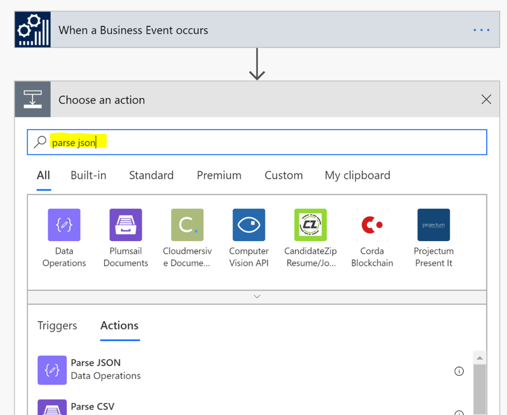

9.Position the cursor in content, for context-sensitive suggestions. From the
    Dynamics content, select Body and place it in the Content input box

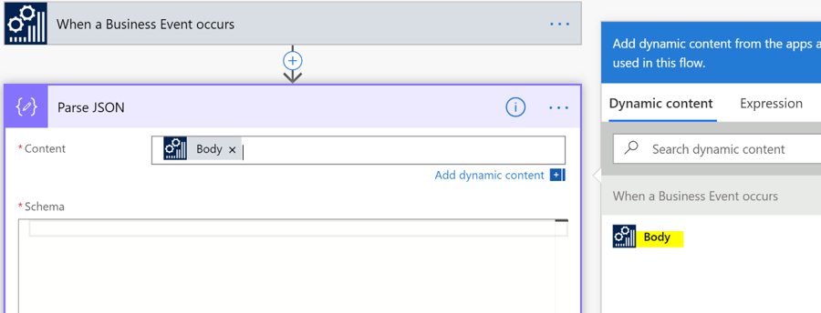

10.Select the highlighted area “**Generate from sample**”; a screen will pop
    up; copy the content of
    *BusinessEventSchema_MLAFlightDetailsPostedBusinessEvent.txt* in the popped
    up screen

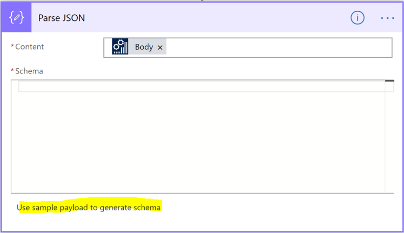

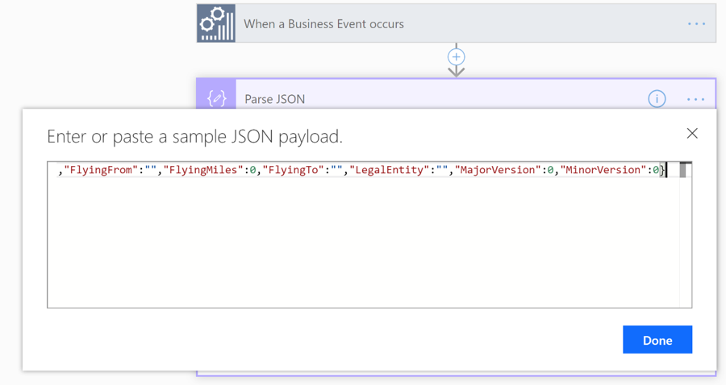

11.Once you select the button **Done**, the schema will be pasted in the Parse
    JSON connector. After saving, click **New step**

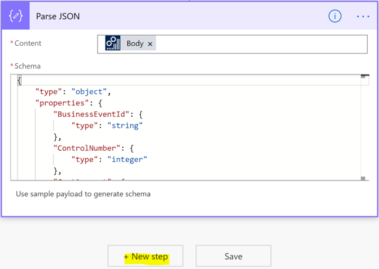

12.In the Choose an action box, type “Outlook.com” and select *Outlook.com –
    Send an email(V2)* as the next connector

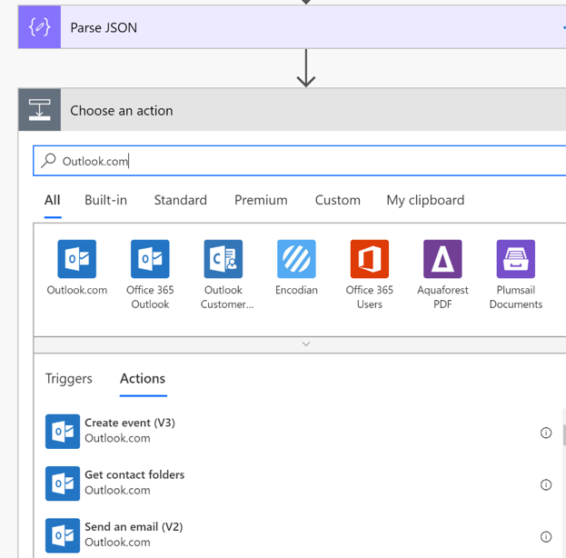

13.Flow will ask for the credential of your outlook/Hotmail/live id. From this
    ID the mail will go to the customer

14.Once your email id is authenticated by Flow, you need to provide further
    details of the mail recipient, subject and body with the help of Dynamics
    content. The connector should look like the following

15.Save the Flow

Check Output
============

-   Open **Accounts Receivables \> All Customers**

-   Select customer “**US-003**” and navigate to **Details \> Contact
    information**

-   Add your own email id

    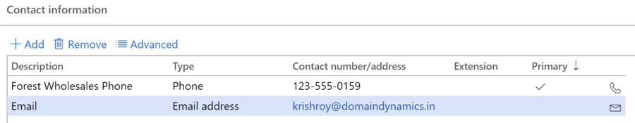

-   Navigate to **Flying Details** and add a new record

-   Go to Flow and check the Run history

    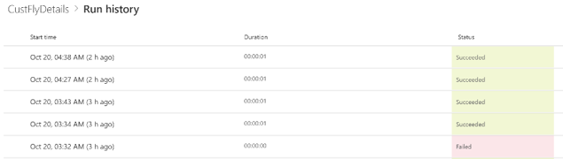

-   You should receive a mail in your mailbox with the details of the Flying
    information entered
